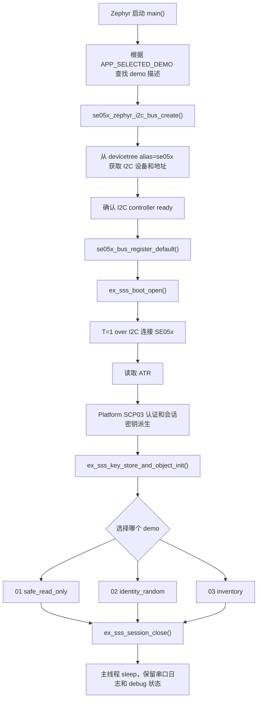
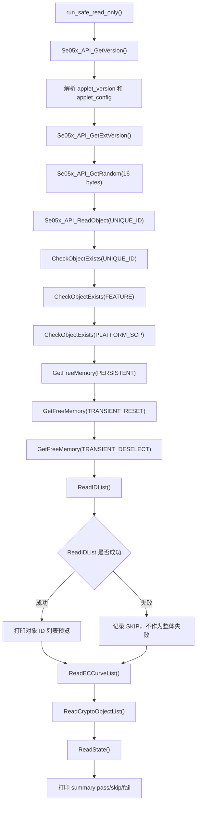
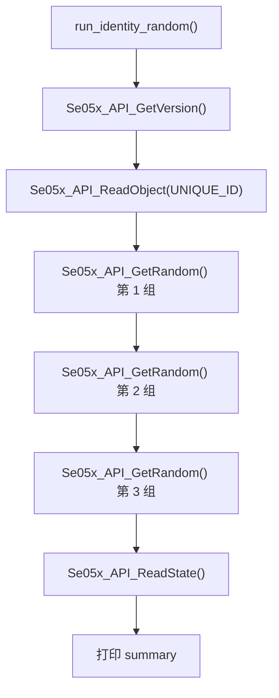
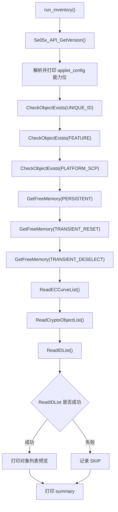
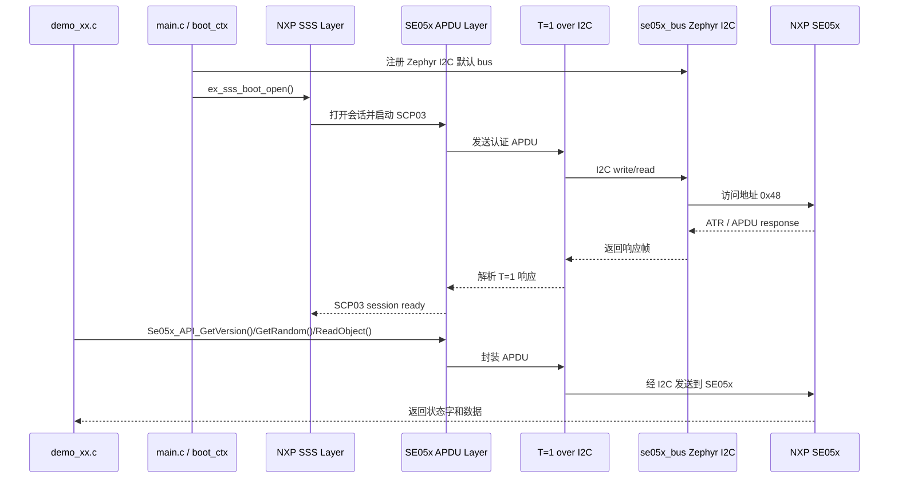

# nRF54LM20 + NXP SE05x 示例工程

> 这是一个面向调试、移植和安全芯片 bring-up 的 Nordic NCS 示例工程。当前目标不是做 OTA、蓝牙、NFC 或完整产品流程，而是先把 nRF54LM20 到 NXP SE05x 的 I2C 通路、Platform SCP03 安全会话、SSS 层和只读 APDU 调用验证清楚。

<p>
  <kbd>Nordic NCS 3.3.0</kbd>
  <kbd>Zephyr OS 4.3.99</kbd>
  <kbd>nRF54LM20 DK</kbd>
  <kbd>NXP SE05x / SE052</kbd>
  <kbd>I2C 100 kHz</kbd>
  <kbd>T=1 over I2C</kbd>
  <kbd>Platform SCP03</kbd>
  <kbd>NXP Plug & Trust</kbd>
  <kbd>SSS API</kbd>
  <kbd>PSA Crypto</kbd>
  <kbd>CRACEN / nrf_security</kbd>
</p>

## 当前验证结论

当前工程已经在 nRF54LM20 + SE05x 硬件上跑通：

- J-Link 能正常识别和 debug。之前无法识别是 USB 数据线问题，不是代码问题。
- 串口能输出 Zephyr 启动日志和应用日志。
- SE05x I2C 设备能被 Zephyr 绑定到 `i2c@c8000`，地址为 `0x48`。
- Platform SCP03 安全会话能打开。
- 只读 SE05x 检查已通过：`pass=13 skip=1 fail=0`。
- `ReadIDList` 出现 `sw=0xFFFF` 时当前作为 skip 处理，不影响整体连通性判断；它不是 SCP03、I2C 或 applet 版本失败。

## 工程定位

这个工程用于回答三类问题：

1. **硬件是否连通**：nRF54LM20 的 I2C 管脚、overlay、供电、上拉、电平和 SE05x 地址是否正确。
2. **安全会话是否正确**：NXP Plug & Trust hostlib 是否能通过 Platform SCP03 认证进入 SE05x。
3. **SE05x 基础能力是否可用**：能否读取 applet 版本、唯一 ID、随机数、对象存在状态、曲线能力、crypto object 列表和内存状态。

为了让调试路径足够清楚，工程刻意保持简单：

- 不包含 OTA。
- 不包含 Bluetooth。
- 不包含 NFC。
- 不包含 MCUBoot。
- 不创建、更新或删除 SE05x 对象。
- 当前 demo 全部是只读或临时随机数读取，不写 SE05x NVM。

## 目录结构

```text
nrf54lm20_se05x/
|-- boards/
|   |-- nrf54lm20dk_nrf54lm20a_cpuapp.overlay
|   `-- nrf54lm20dk_nrf54lm20b_cpuapp.overlay
|-- demo/
|   |-- se05x_demo.h
|   |-- se05x_demo.c
|   |-- se05x_demo_01_safe_read_only.c
|   |-- se05x_demo_02_identity_random.c
|   `-- se05x_demo_03_inventory.c
|-- nxp_se05x/
|   |-- include/
|   |-- nxp/plug-and-trust/
|   `-- port/
|-- se05x_bus/
|   |-- include/
|   `-- src/
|-- src/
|   `-- main.c
|-- CMakeLists.txt
|-- prj.conf
|-- sysbuild.conf
|-- build.cmd
`-- README.md
```

目录职责如下：

| 目录 | 作用 |
| --- | --- |
| `src/` | 只保留主入口。`main.c` 负责 I2C transport 初始化、SCP03 session 打开、demo 选择和分发。 |
| `demo/` | 所有和 SE05x 交互的示例都放这里，按 `se05x_demo_01_xxx.c`、`se05x_demo_02_xxx.c` 编号扩展。 |
| `se05x_bus/` | 平台无关 bus 抽象和 Zephyr I2C 适配层，让 NXP hostlib 不直接依赖 Zephyr API。 |
| `nxp_se05x/nxp/plug-and-trust/` | NXP 官方 Plug & Trust host library、SSS 层、SE05x APDU 层、SCP03 和 T=1 over I2C 协议实现。 |
| `nxp_se05x/port/` | 本工程为 Zephyr/Nordic 补齐的移植层，例如 I2C、timer、reset、mutex、host crypto。 |
| `boards/` | nRF54LM20 DK 的 devicetree overlay，定义 SE05x 所在 I2C 实例、管脚和地址。 |

## 硬件连接

默认硬件配置如下：

| 项目 | 默认值 |
| --- | --- |
| 开发板 | `nrf54lm20dk/nrf54lm20a/cpuapp` |
| I2C 控制器 | `i2c22` |
| SCL | `P1.11` |
| SDA | `P1.12` |
| SE05x 地址 | `0x48` |
| I2C 速率 | `100 kHz` |
| devicetree alias | `se05x` |

配置文件：

- `boards/nrf54lm20dk_nrf54lm20a_cpuapp.overlay`
- `boards/nrf54lm20dk_nrf54lm20b_cpuapp.overlay`

关键 overlay 逻辑：

```dts
/ {
    aliases {
        se05x = &se05x;
    };
};

&i2c22 {
    status = "okay";
    clock-frequency = <I2C_BITRATE_STANDARD>;

    se05x: se05x@48 {
        compatible = "nxp,se05x";
        status = "okay";
        reg = <0x48>;
    };
};
```

`main.c` 不直接写死管脚，而是通过 `se05x` alias 找到 SE05x 节点。后续如果换 I2C 实例、管脚或地址，优先改 overlay。

## SE05x 安全配置

当前使用 Platform SCP03：

| 配置项 | 当前值 | 说明 |
| --- | --- | --- |
| `SSS_HAVE_SE05X_AUTH_PLATFSCP03` | `1` | 使用 Platform SCP03 认证方式。 |
| `SSS_PFSCP_ENABLE_SE052_B501` | `1` | 当前目标配置为 `SE052_B501` profile。 |
| `CONFIG_NRF_SECURITY` | `y` | 使用 Nordic security/PSA crypto。 |
| `CONFIG_PSA_WANT_GENERATE_RANDOM` | `y` | SCP03 握手需要 host 侧随机数。 |
| `CONFIG_PSA_WANT_ALG_CTR_DRBG` | `y` | 给 PSA 随机数生成能力补齐 DRBG。 |

相关文件：

- `nxp_se05x/include/fsl_sss_ftr.h`
- `nxp_se05x/include/fsl_sss_ftr_default.h`
- `prj.conf`

注意：只有在你手上的 SE05x OEF、profile 或密钥来源发生变化时，才应该调整 `fsl_sss_ftr.h` 里的 profile。SCP03 profile 不匹配时，常见现象是能读到 ATR，但 `ex_sss_boot_open()` 或 `nxScp03_AuthenticateChannel()` 失败。

## 构建和烧录

默认构建：

```bat
cd /d F:\nordic_prj\nrf54lm20_se05x
build.cmd
```

指定另一个 board target：

```bat
cd /d F:\nordic_prj\nrf54lm20_se05x
set BOARD=nrf54lm20dk/nrf54lm20b/cpuapp
build.cmd
```

如需覆盖 NCS 或 toolchain 路径，可以新建本地文件 `env.local.cmd`，例如：

```bat
set NCS_ROOT=F:\ncs\v3.3.0
set NCS_TOOLCHAIN=C:\ncs\toolchains\fd21892d0f
```

构建产物通常在：

```text
build_nrf54lm20_se05x/nrf54lm20_se05x/zephyr/zephyr.elf
build_nrf54lm20_se05x/nrf54lm20_se05x/zephyr/zephyr.hex
```

如果构建系统生成的是单应用目录，也可能在：

```text
build_nrf54lm20_se05x/zephyr/zephyr.elf
build_nrf54lm20_se05x/zephyr/zephyr.hex
```

## Demo 选择方式

主入口在 `src/main.c`，只需要改一个宏：

```c
#define APP_SELECTED_DEMO SE05X_DEMO_SAFE_READ_ONLY
```

可选 demo：

| 编号 | 宏 | 文件 | 名称 | 推荐场景 |
| --- | --- | --- | --- | --- |
| 01 | `SE05X_DEMO_SAFE_READ_ONLY` | `demo/se05x_demo_01_safe_read_only.c` | `safe_read_only` | 首次 bring-up、移植验证、完整只读冒烟测试。 |
| 02 | `SE05X_DEMO_IDENTITY_RANDOM` | `demo/se05x_demo_02_identity_random.c` | `identity_random` | 快速确认 SE 身份和随机数能力。 |
| 03 | `SE05X_DEMO_INVENTORY` | `demo/se05x_demo_03_inventory.c` | `inventory` | 查看 SE 能力、保留对象、曲线列表、crypto object 和存储空间。 |

`src/main.c` 不堆具体业务逻辑。新增 demo 时建议遵循：

1. 在 `demo/` 下新增 `se05x_demo_04_xxx.c`。
2. 在 `demo/se05x_demo.h` 里新增枚举。
3. 在 `demo/se05x_demo.c` 的 catalog 里注册。
4. 在 `CMakeLists.txt` 里加入源文件。
5. 在 README 的 demo 章节补充流程图、场景和预期输出。

## 通用启动时序

所有 demo 共享同一段启动流程。这个顺序不能随意打乱，因为后面的 SE05x API 都依赖前面的 transport 和 SCP03 session。



### 通用时序作用

| 阶段 | 为什么必须在这个时刻做 | 失败时通常看到什么 |
| --- | --- | --- |
| I2C bus create | 先确认 Zephyr 能找到 `se05x` 节点和 I2C controller。 | `se05x_zephyr_i2c_bus_create failed`，通常是 overlay、管脚、地址或供电问题。 |
| register default bus | NXP hostlib 通过默认 bus 走 T=1 over I2C，必须先注册。 | 后续 `ex_sss_boot_open()` 没有可用 transport。 |
| `ex_sss_boot_open()` | 建立 SE05x session，并完成 Platform SCP03 认证。 | 能看到 ATR 但 SCP03 失败，可能是 profile/key/host crypto/RNG 配置问题。 |
| key store init | 为后续创建 key object、签名、加密等 demo 准备 SSS 上下文。 | 当前只读 demo 影响较小，写对象类 demo 会依赖它。 |
| demo run | 只在安全会话成功后调用具体 APDU/SSS API。 | 如果绕过 session 直接调用 APDU，容易得到通信或认证错误。 |
| session close | demo 完成后释放 SE05x session。 | 不关闭一般不会立刻失败，但不利于后续扩展和资源管理。 |

## Demo 01：safe_read_only

文件：`demo/se05x_demo_01_safe_read_only.c`

### 适用场景

这是当前最完整、最推荐优先运行的 demo。适合：

- 第一次确认 nRF54LM20 和 SE05x 硬件链路是否正常。
- 移植 NXP Plug & Trust hostlib 到新平台后做冒烟测试。
- 确认 Platform SCP03、基础 APDU、对象读取、能力读取和内存读取都能工作。
- 在不写 SE05x NVM 的前提下，尽量多覆盖 SE05x 只读接口。

### 使用到的 SE05x 能力

| 能力 | API | 作用 |
| --- | --- | --- |
| applet 版本读取 | `Se05x_API_GetVersion()` | 确认 SE05x applet 存在、通信正常，并读取版本和能力 bitmap。 |
| 扩展版本读取 | `Se05x_API_GetExtVersion()` | 获取更完整的 applet/version/config 数据，用于后续兼容性判断。 |
| 硬件随机数 | `Se05x_API_GetRandom()` | 确认 SE05x 内部随机数发生器可用。 |
| 唯一 ID 读取 | `Se05x_API_ReadObject(kSE05x_AppletResID_UNIQUE_ID)` | 读取芯片唯一身份信息，用于设备绑定或产测记录。 |
| 对象存在检查 | `Se05x_API_CheckObjectExists()` | 确认保留对象是否存在，例如 unique ID、feature、platform SCP。 |
| 空间读取 | `Se05x_API_GetFreeMemory()` | 查看 persistent 和 transient 空间剩余量。 |
| 对象列表读取 | `Se05x_API_ReadIDList()` | 尝试枚举对象 ID；当前失败时记为 skip。 |
| ECC 曲线列表 | `Se05x_API_ReadECCurveList()` | 查看 applet 支持或启用的 ECC 曲线状态。 |
| crypto object 列表 | `Se05x_API_ReadCryptoObjectList()` | 查看临时 crypto object 状态。 |
| SE 状态读取 | `Se05x_API_ReadState()` | 读取 SE 当前生命周期或内部状态摘要。 |

### API 调用流程



### 时序作用

Demo 01 的顺序是故意从“最基础”到“更具体”排列：

1. 先读 `GetVersion`，确认 APDU 通道和 applet 响应正常。
2. 再读 `GetExtVersion`，确认扩展版本数据可解析。
3. 再取随机数，确认 SE 内部 TRNG/RNG 服务可用。
4. 再读 unique ID，确认只读对象读取正常。
5. 再检查对象、内存和列表，确认 SE 状态和资源信息可见。

这样排的好处是：如果失败，可以从日志位置直接判断问题层级。例如 `GetVersion` 都失败，优先看通信和 SCP03；如果只有 `ReadIDList` skip，则基础链路已经没问题。

### 期望输出重点

正常情况下会看到类似：

```text
nRF54LM20 + NXP SE05x demo 运行器启动
当前编译选择的 SCP03 profile: SE052_B501
SE05x I2C ready: bus=i2c@c8000 addr=0x48
Applet version: 7.2.22
SAFE_TEST PASS GetVersion
SAFE_TEST PASS GetExtVersion
SAFE_TEST PASS GetRandom
SAFE_TEST PASS ReadObject(UNIQUE_ID)
SAFE_TEST summary: pass=13 skip=1 fail=0
SAFE_TEST overall OK
Demo safe_read_only 总体结果：OK
```

`ReadIDList sw=0xFFFF` 当前属于已知 skip 路径，只要最终 `fail=0`，就说明 demo 01 的核心验证通过。

## Demo 02：identity_random

文件：`demo/se05x_demo_02_identity_random.c`

### 适用场景

这是一个更轻量的快速检查 demo。适合：

- 每次换线、换板、重新烧录之后快速确认 SE05x 在线。
- 产测或调试时读取唯一 ID，确认当前连接的是哪一颗 SE。
- 快速确认随机数接口工作，避免每次都跑完整 inventory。
- 后续扩展成“设备身份读取 + 云端注册”的前置 demo。

### 使用到的 SE05x 能力

| 能力 | API | 作用 |
| --- | --- | --- |
| applet 版本读取 | `Se05x_API_GetVersion()` | 给日志提供 applet 版本和 config，方便确认芯片状态。 |
| unique ID 读取 | `Se05x_API_ReadObject(kSE05x_AppletResID_UNIQUE_ID)` | 获取 SE05x 唯一身份。 |
| 随机数读取 | `Se05x_API_GetRandom()` | 连续读取多组随机数，确认输出不是固定值，也确认接口可重复调用。 |
| 状态读取 | `Se05x_API_ReadState()` | 在快速检查最后读取状态摘要。 |

### API 调用流程



### 时序作用

Demo 02 的重点是“身份在前，随机数在后”：

- 先读版本，是为了确认 APDU 基础通路正常。
- 再读 unique ID，是为了确认当前 SE 的身份。
- 然后连续读随机数，是为了观察 SE 随机服务能否重复稳定调用。
- 最后读 state，用来给日志补一个状态闭环。

这个 demo 比 demo 01 更短，适合日常调试。它不枚举对象、不读取所有内存类型，因此定位范围没有 demo 01 全面。

### 期望输出重点

```text
IDENTITY_RANDOM begin
Applet version: 7.2.22
UniqueID len=18 preview=...
Random[0] len=16 preview=...
Random[1] len=16 preview=...
Random[2] len=16 preview=...
IDENTITY_RANDOM summary: pass=... skip=0 fail=0
Demo identity_random 总体结果：OK
```

## Demo 03：inventory

文件：`demo/se05x_demo_03_inventory.c`

### 适用场景

这是一个偏“盘点”和“能力确认”的 demo。适合：

- 想确认当前 SE05x applet 支持哪些能力。
- 想看 persistent/transient memory 剩余空间。
- 想确认保留对象是否存在。
- 后续准备增加“创建 key、导入证书、签名验签、TLS key store”等写入型 demo 前，先了解当前 SE 状态。

### 使用到的 SE05x 能力

| 能力 | API | 作用 |
| --- | --- | --- |
| applet 版本和能力 | `Se05x_API_GetVersion()` | 打印 applet config，了解 ECDSA、HMAC、RSA、AES、TLS 等能力开关。 |
| 对象存在检查 | `Se05x_API_CheckObjectExists()` | 检查保留对象，例如 unique ID、feature、platform SCP。 |
| 空间读取 | `Se05x_API_GetFreeMemory()` | 查看 persistent、transient reset、transient deselect 三类空间。 |
| ECC 曲线列表 | `Se05x_API_ReadECCurveList()` | 查看 ECC curve 列表。 |
| crypto object 列表 | `Se05x_API_ReadCryptoObjectList()` | 查看临时 crypto object。 |
| 对象 ID 列表 | `Se05x_API_ReadIDList()` | 尝试读取对象列表，失败时可作为 skip 处理。 |

### API 调用流程



### 时序作用

Demo 03 先看能力，再看对象，再看空间：

1. `GetVersion` 给出 applet config，先确认这颗 SE 支持哪些大类能力。
2. `CheckObjectExists` 确认系统保留对象是否可见，尤其是 platform SCP 相关对象。
3. `GetFreeMemory` 读取空间，方便后续判断是否适合导入证书或创建密钥。
4. `ReadECCurveList` 和 `ReadCryptoObjectList` 用于了解当前密码对象和曲线状态。
5. `ReadIDList` 放在最后，因为它在某些配置下可能不开放或返回特殊状态，不应该影响前面更关键的 inventory 判断。

### 期望输出重点

```text
INVENTORY begin
Applet version: 7.2.22
ECDSA_ECDH_ECDHE  : yes
HMAC              : yes
RSA_PLAIN         : yes
AES               : yes
TLS               : yes
GetFreeMemory(PERSISTENT) free=...
ReadECCurveList len=...
ReadCryptoObjectList len=...
INVENTORY summary: pass=... skip=... fail=0
Demo inventory 总体结果：OK
```

## 主机到 SE05x 的调用链

下面这张图描述从 demo API 调用到 SE05x 芯片内部响应的大致链路。



## 典型串口日志解读

你当前已经跑通过的日志核心含义如下：

```text
*** Booting nRF Connect SDK v3.3.0-ba167d9f3db4 ***
*** Using Zephyr OS v4.3.99-fd9204a02d52 ***
SE05x I2C ready: bus=i2c@c8000 addr=0x48
sss :INFO :atr (Len=35)
sss :INFO :Newer version of Applet Found
sss :INFO :Compiled for 0x70200. Got newer 0x70216
SAFE_TEST summary: pass=13 skip=1 fail=0
SAFE_TEST overall OK
```

逐项解释：

| 日志 | 含义 |
| --- | --- |
| `SE05x I2C ready` | Zephyr 已经找到 I2C controller 和 SE05x devicetree 节点。 |
| `atr (Len=35)` | SE05x 对 T=1 over I2C 连接有响应，底层通信已经通。 |
| `Newer version of Applet Found` | 芯片 applet 比 hostlib 编译目标更新。当前已验证可继续使用。 |
| `Compiled for 0x70200. Got newer 0x70216` | hostlib 按 7.2.0 编译，实际 SE applet 是 7.2.22。 |
| `SAFE_TEST summary: pass=13 skip=1 fail=0` | 只读测试 13 项通过，1 项跳过，0 项失败。 |
| `SAFE_TEST overall OK` | demo 01 总体成功。 |

## 常见问题

### 1. J-Link Commander 显示 `Connecting to J-Link via USB...` 后没有识别

优先检查 USB 线。你这次实际就是换数据线后恢复。另一个容易混淆的点是 Windows 里同时存在两个 `jlink.exe`：

```text
C:\Program Files\Eclipse Adoptium\jdk-17.0.10.7-hotspot\bin\jlink.exe
C:\Program Files\SEGGER\JLink_V930\JLink.exe
```

Java 的 `jlink.exe` 不是 SEGGER J-Link。直接运行 SEGGER 路径更明确：

```bat
"C:\Program Files\SEGGER\JLink_V930\JLink.exe"
```

### 2. 能读到 ATR，但 SCP03 失败

这通常说明 I2C 已经通了，但安全会话没有建立。重点检查：

- `fsl_sss_ftr.h` 中的 SCP03 profile 是否匹配当前 SE05x。
- Platform SCP03 key 是否和芯片一致。
- `prj.conf` 是否启用了 PSA crypto、AES、CMAC、CBC/ECB/CTR 和随机数。
- `CONFIG_PSA_WANT_GENERATE_RANDOM=y`
- `CONFIG_PSA_WANT_ALG_CTR_DRBG=y`

### 3. 串口没有日志

检查：

- 串口号是否是当前板子的 VCOM，例如 COM9 或 COM10。
- 波特率是否为 `115200`。
- 是否打开了 `CONFIG_SERIAL=y`、`CONFIG_CONSOLE=y`、`CONFIG_UART_CONSOLE=y`、`CONFIG_LOG=y`。
- 是否烧录的是最新 `zephyr.hex`。

### 4. 断点不好打或代码跳来跳去

当前 `prj.conf` 已经打开：

```text
CONFIG_DEBUG=y
CONFIG_DEBUG_OPTIMIZATIONS=y
```

这比 release 优化更适合源码断点。仍然可能遇到 NXP hostlib 内联或宏较多导致的跳转，这是 C 优化和宏展开的正常现象。建议优先在这些位置打断点：

- `src/main.c` 的 `app_register_transport()`
- `src/main.c` 的 `app_open_se_session()`
- 当前选中 demo 的 `run_xxx()` 函数
- 具体失败 API 调用前后一行

### 5. `ReadIDList sw=0xFFFF` 是否表示失败

在当前 demo 里不作为硬失败。因为它发生在基础链路、SCP03、版本读取、随机数、unique ID、对象存在检查、内存读取之后。只要最终 `fail=0`，就说明当前只读 bring-up 的核心目标已经达到。

## 后续 demo 建议

当前三个 demo 都是安全的只读验证。后续可以按风险从低到高继续扩展：

| 建议编号 | 建议名称 | 是否写 NVM | 场景 |
| --- | --- | --- | --- |
| `04` | `session_health` | 否 | 多次打开/关闭 session，验证长时间调试稳定性。 |
| `05` | `transient_aes` | 否或仅 transient | 使用 transient key 做 AES/CMAC，不落 NVM。 |
| `06` | `ecc_sign_verify` | 可能写 NVM | 创建 ECC key，做签名验签。 |
| `07` | `certificate_store` | 是 | 导入证书或读取证书对象。 |
| `08` | `tls_identity` | 是 | 为 TLS/云连接准备 SE 内部私钥和证书链。 |

写入型 demo 必须在文件头部明确写清：

- 会创建哪些 object ID。
- 是否写 persistent NVM。
- 是否会覆盖已有对象。
- 如何清理。
- 失败后如何恢复。

当前工程的原则是：默认 demo 不写 SE05x NVM；任何写入型 demo 都要显式命名、显式说明、显式选择。
