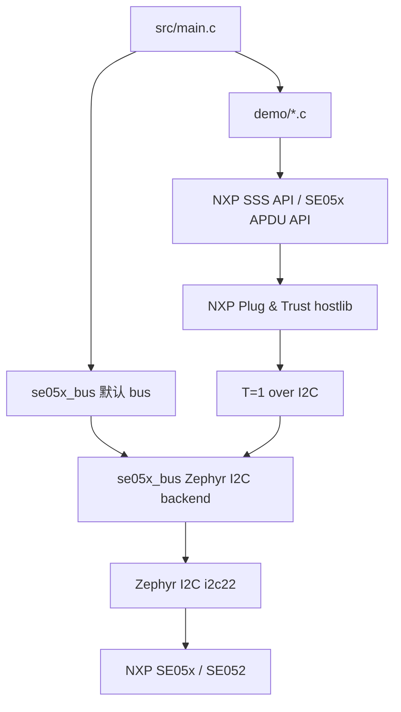

# nRF54LM20 SE05x NCS

> Nordic nRF Connect SDK 版本的 NXP SE05x bring-up 与安全芯片示例工程。  
> 对应 ESP-IDF 版本：[esp32-se05x-idf](https://github.com/tianrking/esp32-se05x-idf)

<p align="center">
  
  
  
  
  
  
  
  
  
  
  
</p>

## 项目说明

这个仓库用于验证 **nRF54LM20 通过 I2C 访问 NXP SE05x/SE052** 的完整基础链路：

- Zephyr devicetree 绑定 SE05x I2C 节点。
- NXP Plug & Trust hostlib 运行在 Nordic NCS/Zephyr 上。
- 通过 T=1 over I2C 和 SE05x 通信。
- 使用 Platform SCP03 建立安全会话。
- 运行只读 demo，读取 applet 版本、唯一 ID、随机数、对象状态、曲线列表和内存状态。

当前工程刻意保持为 bring-up 示例，不包含 OTA、Bluetooth、NFC、MCUBoot 或产品业务流程。默认 demo 不写 SE05x NVM，适合先确认硬件、驱动、SCP03 和 API 适配是否可靠。

## 当前状态

| 项目 | 状态 |
| --- | --- |
| J-Link 下载和 debug | 已验证 |
| 串口日志 | 已验证 |
| Zephyr I2C 绑定 | 已验证，默认 `i2c22`，地址 `0x48` |
| SE05x ATR | 已验证 |
| Platform SCP03 | 已验证 |
| 只读 demo | 已验证，`pass=13 skip=1 fail=0` |
| `ReadIDList sw=0xFFFF` | 当前按 skip 处理，不影响基础连通性结论 |

## 文档入口

根目录 README 只做项目总览和跳转。每个子模块的详细中文说明放在对应目录里：

| 模块 | 文档 | 内容 |
| --- | --- | --- |
| API 参考 | [api/README.md](api/README.md) | 本工程实际使用 API 的作用、入参、输出参数、返回值和 demo 对应关系。 |
| 应用入口 | [src/README.md](src/README.md) | `main.c` 的职责、demo 选择方式、debug 断点建议。 |
| SE05x demo | [demo/README.md](demo/README.md) | 每个 demo 的场景、时序作用、预期输出和 Mermaid API 流程图。 |
| 板级配置 | [boards/README.md](boards/README.md) | nRF54LM20 DK overlay、I2C 管脚、地址和排查方法。 |
| bus 抽象层 | [se05x_bus/README.md](se05x_bus/README.md) | 平台无关 bus contract、Zephyr I2C backend 和调用链。 |
| NXP hostlib 移植 | [nxp_se05x/README.md](nxp_se05x/README.md) | Plug & Trust 来源、目录职责、SCP03 profile、Zephyr porting 层。 |

## 快速开始

构建默认 nRF54LM20A cpuapp 目标：

```bat
cd /d F:\nordic_prj\nrf54lm20_se05x
build.cmd
```

切换到 nRF54LM20B cpuapp：

```bat
cd /d F:\nordic_prj\nrf54lm20_se05x
set BOARD=nrf54lm20dk/nrf54lm20b/cpuapp
build.cmd
```

构建产物通常位于：

```text
build_nrf54lm20_se05x/nrf54lm20_se05x/zephyr/zephyr.elf
build_nrf54lm20_se05x/nrf54lm20_se05x/zephyr/zephyr.hex
```

如果构建系统使用单应用目录，也可能位于：

```text
build_nrf54lm20_se05x/zephyr/zephyr.elf
build_nrf54lm20_se05x/zephyr/zephyr.hex
```

## 默认硬件

| 项目 | 默认值 |
| --- | --- |
| 开发板 | `nrf54lm20dk/nrf54lm20a/cpuapp` |
| I2C 控制器 | `i2c22` |
| SCL | `P1.11` |
| SDA | `P1.12` |
| SE05x 地址 | `0x48` |
| I2C 速率 | `100 kHz` |
| devicetree alias | `se05x` |

硬件和 overlay 细节见 [boards/README.md](boards/README.md)。

## 总体架构



运行顺序概括：

1. `main.c` 创建 Zephyr I2C bus。
2. 注册 `se05x_bus` 默认 transport。
3. `ex_sss_boot_open()` 打开 SE05x session。
4. Platform SCP03 完成安全认证。
5. 根据 `APP_SELECTED_DEMO` 分发到 `demo/` 下的具体示例。
6. demo 调用 NXP APDU/SSS API 和 SE05x 交互。
7. demo 完成后关闭 session，主线程 sleep 方便串口和 debugger 保留现场。

## Demo 选择

当前 demo 由 [src/main.c](src/main.c) 中这个宏选择：

```c
#define APP_SELECTED_DEMO SE05X_DEMO_SAFE_READ_ONLY
```

可选值：

| 宏 | 对应 demo | 说明 |
| --- | --- | --- |
| `SE05X_DEMO_SAFE_READ_ONLY` | Demo 01 | 完整只读冒烟测试，首次 bring-up 推荐。 |
| `SE05X_DEMO_IDENTITY_RANDOM` | Demo 02 | 快速读取身份和随机数。 |
| `SE05X_DEMO_INVENTORY` | Demo 03 | 查看能力、对象、曲线和空间状态。 |

每个 demo 的详细流程见 [demo/README.md](demo/README.md)。

## 典型成功日志

```text
*** Booting nRF Connect SDK v3.3.0-ba167d9f3db4 ***
*** Using Zephyr OS v4.3.99-fd9204a02d52 ***
SE05x I2C ready: bus=i2c@c8000 addr=0x48
sss :INFO :atr (Len=35)
sss :INFO :Newer version of Applet Found
sss :INFO :Compiled for 0x70200. Got newer 0x70216
SAFE_TEST summary: pass=13 skip=1 fail=0
SAFE_TEST overall OK
```

## 和 ESP32 版本的关系

这个仓库是 [esp32-se05x-idf](https://github.com/tianrking/esp32-se05x-idf) 的 Nordic/NCS 平台版本。

两个仓库的设计目标一致：

- 共享 NXP Plug & Trust hostlib 思路。
- 共享 `se05x_bus` 这种平台无关 transport contract。
- 每个平台只替换自己的 I2C、timer、reset、mutex、heap 和 host crypto 后端。
- demo 编号和使用场景尽量保持可对照。

## 许可说明

仓库中 `nxp_se05x/nxp/plug-and-trust/` 保留 NXP Plug & Trust 原始文件和许可说明。使用、分发或商用前请同时确认本工程代码和 NXP 原始组件的许可要求。
