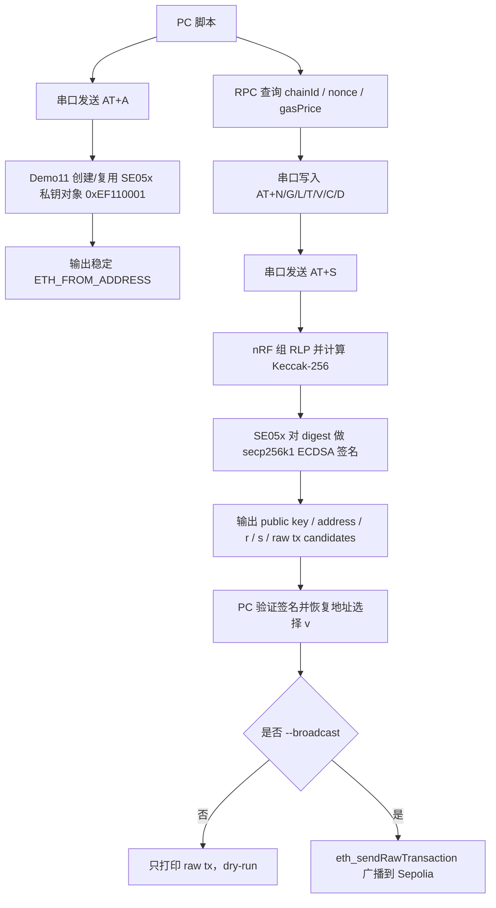

# nRF54LM20 SE05x NCS

> 基于 Nordic NCS 3.3.0 / Zephyr OS 4.3.99 的 nRF54LM20 DK + NXP SE05x/SE052 安全芯片验证工程。
> 对应 ESP32 版本：[esp32-se05x-idf](https://github.com/tianrking/esp32-se05x-idf)

<p align="center">
  
  
  
  
  
  
  
  
  
  
  
</p>

## 项目定位

这个仓库验证 nRF54LM20 通过 I2C 访问 NXP SE05x/SE052 的完整链路：

- Zephyr devicetree 绑定 SE05x I2C 节点，默认 `i2c22`、地址 `0x48`、100 kHz。
- NXP Plug & Trust hostlib 移植到 Nordic NCS / Zephyr。
- 使用 T=1 over I2C 与 SE05x 通信。
- 通过 Platform SCP03 建立安全会话。
- 使用 SE05x APDU API 与 SSS API 完成只读探测、对象写入、证书保存、TLS 身份、secp256k1 能力验证、ETH 签名和 Sepolia 测试网交易签名。

当前默认运行 Demo11：`SE05X_DEMO_ETH_TESTNET_WALLET`。它会创建或复用 SE05x 内部持久化 secp256k1 钱包私钥对象 `0xEF110001`，输出稳定 ETH 地址，并支持通过串口接收真实交易字段后由 SE05x 签名。

## 文档入口

| 模块 | 文档 | 内容 |
| --- | --- | --- |
| 应用入口 | [src/README.md](src/README.md) | `main.c` 职责、demo 切换、调试断点建议。 |
| Demo 集合 | [demo/README.md](demo/README.md) | Demo00-Demo11 的场景、NVM 风险、API 流程、钱包链路。 |
| API 参考 | [api/README.md](api/README.md) | 本工程实际使用 API 的作用、参数、返回值、对应 demo。 |
| 板级配置 | [boards/README.md](boards/README.md) | nRF54LM20 DK overlay、I2C 管脚、地址、排查方法。 |
| bus 抽象 | [se05x_bus/README.md](se05x_bus/README.md) | 平台无关 bus contract 与 Zephyr I2C backend。 |
| NXP hostlib | [nxp_se05x/README.md](nxp_se05x/README.md) | Plug & Trust 来源、目录职责、SCP03 profile、Zephyr porting 层。 |
| PC 工具 | [tools/README.md](tools/README.md) | Demo09/Demo10/Demo11 的 PC 侧验证、Sepolia dry-run 与广播脚本。 |

## 快速构建

```bat
cd /d F:\nordic_prj\nrf54lm20_se05x
build.cmd
```

默认目标：

```text
nrf54lm20dk/nrf54lm20a/cpuapp
```

构建产物通常位于：

```text
build_nrf54lm20_se05x/nrf54lm20_se05x/zephyr/zephyr.elf
build_nrf54lm20_se05x/nrf54lm20_se05x/zephyr/zephyr.hex
```

## Demo 总览

| 编号 | 宏 | 名称 | 主要用途 | NVM 风险 |
| --- | --- | --- | --- | --- |
| 00 | `SE05X_DEMO_UART_SAFE_API` | `uart_safe_api` | UART 交互式安全 API 菜单。 | 不写 |
| 01 | `SE05X_DEMO_SAFE_READ_ONLY` | `safe_read_only` | 完整只读冒烟测试。 | 不写 |
| 02 | `SE05X_DEMO_IDENTITY_RANDOM` | `identity_random` | 读取身份、UniqueID、随机数。 | 不写 |
| 03 | `SE05X_DEMO_INVENTORY` | `inventory` | 查看能力、曲线、空间、对象状态。 | 不写 |
| 04 | `SE05X_DEMO_BUSINESS_ONBOARDING` | `business_onboarding` | 设备注册/产测上报前置流程。 | 不写 |
| 05 | `SE05X_DEMO_PROVISIONING_CHECK` | `provisioning_check` | 应用 key/证书写入前预检。 | 不写 |
| 06 | `SE05X_DEMO_ECC_SIGN_VERIFY` | `ecc_sign_verify` | 写入 demo ECC key 并签名验签。 | 写 `0xEF060001` |
| 07 | `SE05X_DEMO_CERTIFICATE_STORE` | `certificate_store` | 写入 demo 证书并回读校验。 | 写 `0xEF070001` |
| 08 | `SE05X_DEMO_TLS_CLIENT_IDENTITY` | `tls_client_identity` | 复用 06/07 模拟 TLS 客户端身份。 | 不新写 |
| 09 | `SE05X_DEMO_WALLET_CURVE_CHECK` | `wallet_curve_check` | 验证 secp256k1 曲线启用、生成临时 key、签名验签。 | 曲线未启用时写一次曲线参数 |
| 10 | `SE05X_DEMO_ETH_WALLET_SIGN` | `eth_wallet_sign` | ETH legacy 交易 RLP/Keccak/临时 key 签名研究。 | 曲线未启用时写一次曲线参数 |
| 11 | `SE05X_DEMO_ETH_TESTNET_WALLET` | `eth_testnet_wallet` | 使用 SE05x 持久化私钥签真实 Sepolia 交易字段。 | 写曲线参数和钱包 key |

## Demo11 Sepolia 测试网流程

Demo11 不是模拟签名。签名动作发生在 SE05x 内部，PC 脚本只负责查询链上参数、把交易字段发给板子、验证板子输出、选择正确 raw transaction，并且只有显式加 `--broadcast` 才广播。



典型操作：

```bat
python tools\broadcast_demo11_sepolia_tx.py --port COM9 --to 0x接收地址 --value-wei 100000000000000 --save-log demo11.log
```

确认地址、金额、nonce、gasPrice 都正确，并且 `SELECTED_RAW_TX` 正常后，再显式广播：

```bat
python tools\broadcast_demo11_sepolia_tx.py --port COM9 --to 0x接收地址 --value-wei 100000000000000 --broadcast
```

重要安全边界：

- SE05x 私钥对象 `0xEF110001` 不导出、不打印，掉电后仍保留。
- `AT+X=DELETE_TESTNET_KEY` 会删除 Demo11 钱包 key，删除后地址会变化，除非你有备份/恢复设计，否则不要随便执行。
- Demo11 当前是研究级测试网流程，不包含屏幕确认、PIN、反钓鱼、固件防回滚、交易白名单、多链派生路径等生产钱包必须能力。

## 和 ESP32 版本的关系

本仓库是 [esp32-se05x-idf](https://github.com/tianrking/esp32-se05x-idf) 的 Nordic/NCS 平台版本。两个仓库的目标一致：验证 SE05x 安全芯片链路，并保持 demo 编号、业务场景、bus 抽象思路尽量可对照。

## 许可说明

`nxp_se05x/nxp/plug-and-trust/` 保留 NXP Plug & Trust 原始文件和许可说明。使用、分发或商用前，请同时确认本工程代码和 NXP 原始组件的许可要求。
