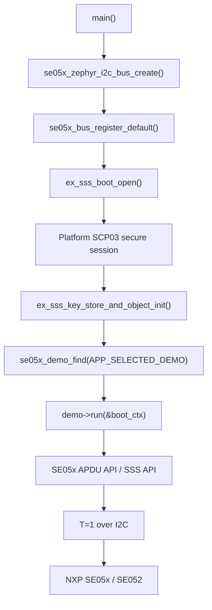

# API 参考说明

本文只说明本工程已经实际调用并验证过的 API，不把 NXP Plug & Trust hostlib 里尚未接入的接口写成项目能力。

## 总体调用链



## 公共类型

| 类型 | 含义 |
| --- | --- |
| `ex_sss_boot_ctx_t` | NXP SSS 示例层上下文，保存 SE session、host session、key store 等。 |
| `sss_status_t` | SSS API 返回值，成功通常是 `kStatus_SSS_Success`。 |
| `pSe05xSession_t` | SE05x APDU 层 session 指针。 |
| `smStatus_t` | APDU 层状态字封装，成功通常是 `SM_OK`。 |
| `SE05x_Result_t` | 对象存在等查询结果，常见值是 `kSE05x_Result_SUCCESS` / `kSE05x_Result_FAILURE`。 |
| `SE05x_MemoryType_t` | SE05x 存储区域类型，例如 persistent、transient reset、transient deselect。 |

## 启动和会话 API

### `ex_sss_boot_open`

```c
sss_status_t ex_sss_boot_open(ex_sss_boot_ctx_t *pCtx, const char *portName);
```

| 项目 | 说明 |
| --- | --- |
| 作用 | 打开 SE05x session，读取 ATR，并按当前配置完成 Platform SCP03 安全认证。 |
| 入参 `pCtx` | 调用前清零；成功后填入 session、host、key store 等上下文。 |
| 入参 `portName` | 本工程传 `NULL`，底层通过 `se05x_bus` 默认 I2C backend 访问 SE05x。 |
| 返回值 | `kStatus_SSS_Success` 成功；其他值表示 I2C/T=1/SCP03/host crypto 等环节失败。 |
| 使用位置 | `src/main.c` 的 `app_open_se_session()`。 |

### `ex_sss_key_store_and_object_init`

```c
sss_status_t ex_sss_key_store_and_object_init(ex_sss_boot_ctx_t *pCtx);
```

| 项目 | 说明 |
| --- | --- |
| 作用 | 初始化 SSS key store 和 key object 上下文。 |
| 入参 | 已打开 session 的 `ex_sss_boot_ctx_t`。 |
| 返回值 | `kStatus_SSS_Success` 成功。 |
| 使用位置 | 写 key、生成 key、签名、验签类 demo 的前置步骤。 |

### `ex_sss_session_close`

```c
void ex_sss_session_close(ex_sss_boot_ctx_t *pCtx);
```

| 项目 | 说明 |
| --- | --- |
| 作用 | 关闭 SSS/SE05x session，释放 hostlib 会话资源。 |
| 入参 | 已打开 session 的 `ex_sss_boot_ctx_t`。 |
| 返回值 | 无。 |
| 使用位置 | demo 运行结束后由 `main.c` 调用。 |

## `se05x_bus` API

### `se05x_zephyr_i2c_bus_create`

```c
int se05x_zephyr_i2c_bus_create(se05x_bus_t *bus,
                                const se05x_zephyr_i2c_config_t *config);
```

| 项目 | 说明 |
| --- | --- |
| 作用 | 从 devicetree alias `se05x` 创建 Zephyr I2C backend。 |
| 入参 `bus` | 输出参数，成功后得到可注册的 bus ops。 |
| 入参 `config` | `NULL` 表示使用默认 devicetree 配置。 |
| 返回值 | `0` 成功；非 0 表示配置、设备 ready、内存等错误。 |

### `se05x_bus_register_default`

```c
int se05x_bus_register_default(const se05x_bus_ops_t *ops);
```

| 项目 | 说明 |
| --- | --- |
| 作用 | 注册默认 bus，让 NXP porting 层知道通过哪条 I2C 链路访问 SE05x。 |
| 入参 | `se05x_zephyr_i2c_bus_create()` 生成的 `ops`。 |
| 返回值 | `0` 成功。 |
| 时序 | 必须在 `ex_sss_boot_open()` 前调用。 |

## 只读/查询 APDU API

| API | 入参 | 输出 | 返回 | Demo |
| --- | --- | --- | --- | --- |
| `Se05x_API_GetVersion()` | SE session、输出 buffer、长度指针 | applet version、config、SecureBox version | `SM_OK` 成功 | 00/01/02/03/04/05 |
| `Se05x_API_GetExtVersion()` | SE session、输出 buffer、长度指针 | 扩展版本字节流 | `SM_OK` 成功 | 00/01 |
| `Se05x_API_GetRandom()` | SE session、输出 buffer、长度指针 | SE05x 随机数 | `SM_OK` 成功 | 00/01/02/04/05 |
| `Se05x_API_ReadObject()` | SE session、object ID、offset、长度 | 对象内容 | `SM_OK` 成功 | 00/01/02/07/08 |
| `Se05x_API_CheckObjectExists()` | SE session、object ID | `SE05x_Result_t` 是否存在 | `SM_OK` 成功 | 00/01/03/04/05/06/07/08/09/10/11 |
| `Se05x_API_GetFreeMemory()` | SE session、memory type | 剩余字节数 | `SM_OK` 成功 | 00/01/03/05 |
| `Se05x_API_ReadECCurveList()` | SE session、输出 buffer、长度指针 | ECC 曲线状态列表 | `SM_OK` 成功 | 00/01/03/05/09/10/11 |
| `Se05x_API_ReadCryptoObjectList()` | SE session、输出 buffer、长度指针 | crypto object 列表 | `SM_OK` 成功 | 00/01/03/05 |
| `Se05x_API_ReadState()` | SE session、输出 buffer、长度指针 | applet 状态字节 | `SM_OK` 成功 | 00/01/02/04 |
| `Se05x_API_ReadIDList()` | SE session、过滤条件、输出 buffer | object ID 列表 | 某些 OEF 可能返回失败，本工程按 SKIP 处理 | 00/01/03 |

## 曲线和对象写入 API

### `Se05x_API_CreateCurve`

| 项目 | 说明 |
| --- | --- |
| 作用 | 将曲线参数写入 SE05x persistent NVM，使 applet 能使用该曲线。 |
| Demo | 09/10/11。 |
| 风险 | 这是 NVM 写入。当前只在 `secp256k1` 是 `NOT_SET` 时执行一次。 |
| 钱包意义 | BTC/ETH 需要 secp256k1；如果这一步成功，说明这颗 SE05x 可以走 SE 内 secp256k1 ECDSA 签名方向。 |

### `Se05x_API_DeleteSecureObject`

| 项目 | 说明 |
| --- | --- |
| 作用 | 删除指定 object ID。 |
| Demo | 09/10 清理测试对象；11 仅在明确发送 `AT+X=DELETE_TESTNET_KEY` 时删除钱包 key。 |
| 风险 | 会修改 NVM 元数据。只能删除本 demo 保留 ID，不能对未知业务 ID 乱删。 |

## SSS key object / key store API

### `sss_key_object_init`

```c
sss_status_t sss_key_object_init(sss_object_t *keyObject, sss_key_store_t *keyStore);
```

| 项目 | 说明 |
| --- | --- |
| 作用 | 初始化一个 key object 句柄。 |
| 入参 | key object 指针、key store 指针。 |
| 返回 | `kStatus_SSS_Success` 成功。 |
| Demo | 06/08/09/10/11。 |

### `sss_key_object_allocate_handle`

```c
sss_status_t sss_key_object_allocate_handle(sss_object_t *keyObject,
                                            uint32_t keyId,
                                            sss_key_part_t keyPart,
                                            sss_cipher_type_t cipherType,
                                            size_t keyByteLenMax,
                                            sss_key_object_mode_t options);
```

| 参数 | Demo11 中的值 | 含义 |
| --- | --- | --- |
| `keyId` | `0xEF110001` | Demo11 钱包 key 对象 ID。 |
| `keyPart` | `kSSS_KeyPart_Pair` | 生成公私钥对。 |
| `cipherType` | `kSSS_CipherType_EC_NIST_K` | secp256k1 属于 Koblitz/NIST-K 曲线族。 |
| `keyByteLenMax` | `32` | 256-bit 曲线私钥长度。 |
| `options` | persistent 或 transient | Demo11 用 persistent，Demo09/10 测试用 transient。 |

### `sss_key_store_generate_key`

```c
sss_status_t sss_key_store_generate_key(sss_key_store_t *keyStore,
                                        sss_object_t *keyObject,
                                        size_t keyBitLen,
                                        void *options);
```

| 项目 | 说明 |
| --- | --- |
| 作用 | 让 SE05x 在内部生成 key。私钥不会离开 SE05x。 |
| Demo11 入参 | `keyBitLen = 256`，对象 `0xEF110001`。 |
| 返回 | `kStatus_SSS_Success` 成功。 |
| 钱包意义 | 这是 Demo11 钱包地址的根来源。删除对象后地址会变化。 |

### `sss_key_store_get_key`

| 项目 | 说明 |
| --- | --- |
| 作用 | 读取 key object 的可导出部分。对 ECC key pair 来说，本工程只用于读取公钥点。 |
| Demo | 09/10/11。 |
| 安全边界 | 私钥不可导出；公钥可导出，用于地址推导和验签。 |

## 签名验签 API

### `sss_asymmetric_context_init`

| 项目 | 说明 |
| --- | --- |
| 作用 | 初始化非对称签名/验签上下文。 |
| 关键参数 | session、key object、算法、模式。 |
| Demo | 06/08/09/10/11。 |

### `sss_asymmetric_sign_digest`

| 项目 | 说明 |
| --- | --- |
| 作用 | 使用 SE05x 内部私钥对 32 字节 digest 签名。 |
| 入参 | digest 指针和长度、签名输出 buffer、签名长度指针。 |
| 输出 | DER 编码 ECDSA 签名。 |
| Demo11 用法 | 对 ETH legacy signing RLP 的 Keccak-256 digest 签名。 |
| 安全边界 | 私钥不导出；SE05x 只返回签名。 |

### `sss_asymmetric_verify_digest`

| 项目 | 说明 |
| --- | --- |
| 作用 | 使用公钥或 key pair 对 digest 和 DER 签名进行验签。 |
| Demo | 06/08/09/10/11。 |
| 返回 | `kStatus_SSS_Success` 表示验签成功。 |

## Ethereum 辅助逻辑

这些不是 SE05x API，而是 Demo10/Demo11 在 nRF 侧实现的协议逻辑：

| 逻辑 | 作用 |
| --- | --- |
| RLP 编码 | 将 legacy/EIP-155 交易字段编码为 signing payload。 |
| Keccak-256 | Ethereum 使用 Keccak-256 计算 signing hash 和地址，不是 FIPS SHA3-256。 |
| 地址推导 | `address = last20(Keccak256(pubkey_x || pubkey_y))`。 |
| DER 解析 | 从 SE05x 返回的 DER ECDSA 签名中解析 `r/s`。 |
| low-S 归一化 | Ethereum 要求使用低 S 值，避免签名延展性。 |
| `v` 候选 | SE05x 不返回 recovery id，所以固件输出两个候选，PC/手机根据恢复地址选择正确值。 |
