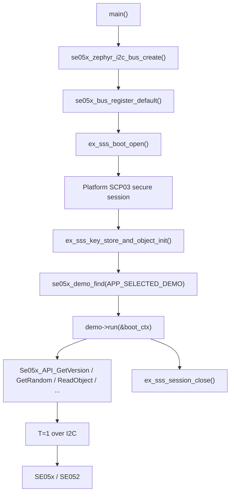

# API 参考说明

本文档说明本工程**实际使用和封装的 API**，包括：

- 应用启动和 SE05x session API。
- `se05x_bus` 平台无关 I2C transport API。
- Zephyr I2C backend API。
- demo framework API。
- 当前三个 demo 调用到的 SE05x APDU API。

NXP Plug & Trust hostlib 内部还有大量未使用的对象创建、密钥导入、签名、加密、TLS、证书等 API。那些 API 暂时不在本文档范围内，避免把未验证接口写成项目能力。后续新增 demo 时，再把对应 API 按同样格式补进来。

## 总体调用链



## 公共类型和返回值约定

| 类型 | 来源 | 含义 |
| --- | --- | --- |
| `ex_sss_boot_ctx_t` | NXP SSS example boot layer | 保存 host session、SE session、key store、key object 等上下文。`main.c` 中的 `s_boot_ctx` 就是这个类型。 |
| `sss_status_t` | NXP SSS layer | SSS 层函数返回值。常见成功值是 `kStatus_SSS_Success`。 |
| `pSe05xSession_t` | NXP SE05x APDU layer | SE05x APDU 层 session 指针，demo 中从 `boot_ctx->session` 转换得到。 |
| `smStatus_t` | NXP secure messaging/APDU layer | APDU 函数返回的状态字封装。常见成功值是 `SM_OK`。 |
| `size_t *xxxLen` | NXP APDU API 约定 | 通常是输入输出参数：调用前填 buffer 容量，返回后改成实际写入长度。 |
| `SE05x_Result_t` | NXP SE05x enum | 对象存在等查询的结果。常用值：`kSE05x_Result_SUCCESS`、`kSE05x_Result_FAILURE`。 |
| `SE05x_MemoryType_t` | NXP SE05x enum | 空间类型。常用值：`PERSISTENT`、`TRANSIENT_RESET`、`TRANSIENT_DESELECT`。 |

### 长度参数约定

很多 SE05x APDU API 使用这种形式：

```c
uint8_t buffer[128];
size_t buffer_len = sizeof(buffer);
smStatus_t sw = Some_API(..., buffer, &buffer_len);
```

含义是：

1. 调用前，`buffer_len` 表示 `buffer` 最大容量。
2. 调用后，如果成功，`buffer_len` 表示 SE05x 实际返回了多少字节。
3. 如果 `buffer` 太小，API 可能失败或返回不完整数据，具体取决于 NXP hostlib 和 applet 响应。

## 启动和 session API

这些 API 在 `src/main.c` 中使用，负责打开和关闭 SE05x 会话。

### `ex_sss_boot_open`

```c
sss_status_t ex_sss_boot_open(ex_sss_boot_ctx_t *pCtx, const char *portName);
```

| 项目 | 说明 |
| --- | --- |
| 作用 | 打开 NXP SSS example session。本工程配置为 Platform SCP03，因此这一步会连接 SE05x、读取 ATR、完成 SCP03 认证并建立安全会话。 |
| 调用位置 | `src/main.c` 的 `app_open_se_session()`。 |
| `pCtx` | 输入输出参数。调用前由应用清零；调用成功后填入 SE session、host session、连接状态等上下文。 |
| `portName` | 连接字符串。本工程传 `NULL`，底层通过 `se05x_bus` 默认 bus 访问 Zephyr I2C。 |
| 返回值 | `kStatus_SSS_Success` 表示成功；其他值表示 session 或 SCP03 打开失败。 |
| 失败重点 | I2C/T=1 通路、SCP03 profile/key、PSA host crypto、host RNG 配置。 |

### `ex_sss_key_store_and_object_init`

```c
sss_status_t ex_sss_key_store_and_object_init(ex_sss_boot_ctx_t *pCtx);
```

| 项目 | 说明 |
| --- | --- |
| 作用 | 初始化 SSS key store 和 key object 上下文。只读 demo 对它依赖不强，但后续创建 key、签名、加密、证书类 demo 会需要。 |
| 调用位置 | `src/main.c` 的 `app_open_se_session()`，在 `ex_sss_boot_open()` 成功之后。 |
| `pCtx` | 输入输出参数。必须是已经成功打开 session 的 boot context。 |
| 返回值 | `kStatus_SSS_Success` 表示初始化成功；失败时当前工程只打印 warning，不阻止只读 demo 运行。 |
| 时序要求 | 必须在 `ex_sss_boot_open()` 之后调用。 |

### `ex_sss_session_close`

```c
void ex_sss_session_close(ex_sss_boot_ctx_t *pCtx);
```

| 项目 | 说明 |
| --- | --- |
| 作用 | 关闭 SSS/SE05x session，释放 NXP hostlib 维护的会话资源。 |
| 调用位置 | `src/main.c` 中 demo 运行完成之后。 |
| `pCtx` | 输入参数。传入已经打开过 session 的 boot context。 |
| 返回值 | 无。 |
| 时序要求 | demo 完成后调用。当前主线程之后进入 sleep，用于保留串口日志和 debug 状态。 |

## `se05x_bus` 平台无关 API

这些 API 定义在 `se05x_bus/include/se05x_bus.h`。它们把 NXP hostlib 和具体平台 I2C 实现解耦。

### `se05x_bus_ops_t`

```c
typedef struct {
    int (*open)(se05x_bus_t *bus);
    void (*close)(se05x_bus_t *bus);
    int (*write)(se05x_bus_t *bus, uint8_t address, const uint8_t *data, size_t data_len);
    int (*read)(se05x_bus_t *bus, uint8_t address, uint8_t *data, size_t data_len);
    void (*delay_ms)(uint32_t delay_ms);
    void *ctx;
} se05x_bus_ops_t;
```

| 成员 | 方向 | 作用 |
| --- | --- | --- |
| `open` | backend 实现，上层调用 | 打开底层 bus。Zephyr backend 当前主要做上下文准备，真正 ready 状态在 create 阶段确认。 |
| `close` | backend 实现，上层调用 | 关闭或释放 bus 相关资源。 |
| `write` | backend 实现，上层调用 | 向指定 I2C 地址写入 `data_len` 字节。 |
| `read` | backend 实现，上层调用 | 从指定 I2C 地址读取 `data_len` 字节。 |
| `delay_ms` | backend 实现，上层调用 | 给 NXP T=1 over I2C 层提供毫秒延时。 |
| `ctx` | backend 私有数据 | 保存 Zephyr `i2c_dt_spec`、timeout 等平台上下文。 |

### `se05x_bus_register_default`

```c
int se05x_bus_register_default(const se05x_bus_ops_t *ops);
```

| 项目 | 说明 |
| --- | --- |
| 作用 | 注册默认 bus。NXP porting 层通过这个默认 bus 访问 SE05x。 |
| 调用位置 | `src/main.c` 的 `app_register_transport()`。 |
| `ops` | 输入参数。指向已经初始化好的平台 bus 操作表。 |
| 返回值 | `0` 表示成功；非 0 表示参数无效或注册失败。 |
| 时序要求 | 必须在 `ex_sss_boot_open()` 前调用。 |

### `se05x_bus_get_default`

```c
const se05x_bus_ops_t *se05x_bus_get_default(void);
```

| 项目 | 说明 |
| --- | --- |
| 作用 | 获取当前默认 bus 操作表。 |
| 调用位置 | NXP porting 层，例如 `i2c_a7_zephyr_bus.c`。 |
| 入参 | 无。 |
| 返回值 | 成功时返回默认 bus ops 指针；未注册时返回 `NULL`。 |

### `se05x_bus_clear_default`

```c
void se05x_bus_clear_default(void);
```

| 项目 | 说明 |
| --- | --- |
| 作用 | 清除默认 bus 注册。 |
| 当前使用 | 当前主流程没有主动调用，预留给后续反初始化或多平台测试使用。 |
| 入参 | 无。 |
| 返回值 | 无。 |

## Zephyr I2C backend API

这些 API 定义在 `se05x_bus/include/se05x_bus_zephyr.h`。

### `se05x_zephyr_i2c_default_config`

```c
se05x_zephyr_i2c_config_t se05x_zephyr_i2c_default_config(void);
```

| 项目 | 说明 |
| --- | --- |
| 作用 | 从 devicetree alias `se05x` 生成默认 Zephyr I2C 配置。 |
| 入参 | 无。 |
| 返回值 | `se05x_zephyr_i2c_config_t`，包含 `struct i2c_dt_spec i2c` 和 `timeout_ms`。 |
| 使用场景 | `se05x_zephyr_i2c_bus_create()` 在 `config == NULL` 时使用它。 |

### `se05x_zephyr_i2c_bus_create`

```c
int se05x_zephyr_i2c_bus_create(se05x_bus_t *bus,
                                const se05x_zephyr_i2c_config_t *config);
```

| 项目 | 说明 |
| --- | --- |
| 作用 | 创建 Zephyr I2C backend，把 Zephyr `i2c_dt_spec` 封装成 `se05x_bus_t`。 |
| 调用位置 | `src/main.c` 的 `app_register_transport()`。 |
| `bus` | 输出参数。调用成功后填入可注册到 `se05x_bus_register_default()` 的 ops。 |
| `config` | 输入参数。为 `NULL` 时使用 devicetree alias `se05x` 的默认配置；非 `NULL` 时使用调用者提供的 I2C 配置。 |
| 返回值 | `0` 表示成功；非 0 表示分配失败、I2C device not ready 或配置错误。 |
| 失败重点 | overlay、I2C 实例、SCL/SDA 管脚、SE05x 地址、Zephyr device ready 状态。 |

### `se05x_zephyr_i2c_default_address`

```c
uint8_t se05x_zephyr_i2c_default_address(void);
```

| 项目 | 说明 |
| --- | --- |
| 作用 | 返回 devicetree alias `se05x` 对应节点的 I2C 地址。当前默认是 `0x48`。 |
| 入参 | 无。 |
| 返回值 | 8 位 I2C 地址。 |
| 使用场景 | NXP porting 层需要知道 SE05x slave address 时使用。 |

## Demo framework API

这些 API 定义在 `demo/se05x_demo.h`，实现位于 `demo/se05x_demo.c`。

### demo 描述结构

```c
typedef struct {
    se05x_demo_id_t id;
    const char *name;
    const char *when_to_use;
    const char *flow;
    const char *expected_output;
    const char *se_features;
    sss_status_t (*run)(ex_sss_boot_ctx_t *boot_ctx);
} se05x_demo_t;
```

| 成员 | 作用 |
| --- | --- |
| `id` | demo 编号，和 `APP_SELECTED_DEMO` 对应。 |
| `name` | 短名称，串口日志中显示。 |
| `when_to_use` | 说明什么时候运行这个 demo。 |
| `flow` | 说明 demo 的主要执行流程。 |
| `expected_output` | 说明期望串口输出和通过条件。 |
| `se_features` | 说明用到的 SE05x 功能或 APDU 类型。 |
| `run` | demo 入口函数，参数是已经打开 SCP03 session 的 `boot_ctx`。 |

### `se05x_demo_find`

```c
const se05x_demo_t *se05x_demo_find(se05x_demo_id_t id);
```

| 项目 | 说明 |
| --- | --- |
| 作用 | 根据 demo ID 查找 demo 描述结构。 |
| 调用位置 | `src/main.c`。 |
| `id` | 输入参数，例如 `SE05X_DEMO_SAFE_READ_ONLY`。 |
| 返回值 | 找到时返回 `se05x_demo_t *`；找不到返回 `NULL`。 |

### `se05x_demo_log_catalog`

```c
void se05x_demo_log_catalog(void);
```

| 项目 | 说明 |
| --- | --- |
| 作用 | 在串口打印当前编译进固件的 demo 列表。 |
| 入参 | 无。 |
| 返回值 | 无。 |

### `se05x_demo_log_selection`

```c
void se05x_demo_log_selection(const se05x_demo_t *demo);
```

| 项目 | 说明 |
| --- | --- |
| 作用 | 打印当前选中的 demo 名称、适用场景、流程、预期输出和 SE05x 功能。 |
| `demo` | 输入参数。通常来自 `se05x_demo_find()`。 |
| 返回值 | 无。`demo == NULL` 时打印错误日志。 |

### `se05x_demo_active_scp03_profile`

```c
const char *se05x_demo_active_scp03_profile(void);
```

| 项目 | 说明 |
| --- | --- |
| 作用 | 根据编译期 `SSS_PFSCP_ENABLE_xxx` 宏返回当前 SCP03 profile 名称。 |
| 入参 | 无。 |
| 返回值 | 字符串，例如当前工程常见为 `SE052_B501`；未知配置返回 `unknown`。 |

### 统计和日志 API

| API | 作用 | 入参 | 返回值 |
| --- | --- | --- | --- |
| `se05x_demo_stats_init(se05x_demo_stats_t *stats, const char *tag)` | 初始化 pass/skip/fail 统计。 | `stats` 输出统计结构；`tag` 日志前缀。 | 无 |
| `se05x_demo_stats_result(const se05x_demo_stats_t *stats)` | 把统计结果转换为 SSS 返回值。 | `stats` 输入统计结构。 | `fail == 0` 返回 `kStatus_SSS_Success`，否则返回 `kStatus_SSS_Fail`。 |
| `se05x_demo_log_summary(const se05x_demo_stats_t *stats)` | 打印 pass/skip/fail 汇总。 | `stats` 输入统计结构。 | 无 |
| `se05x_demo_mark_pass(se05x_demo_stats_t *stats, const char *name)` | 某检查项通过。 | `stats` 统计结构；`name` 检查项名称。 | 无 |
| `se05x_demo_mark_fail_sw(se05x_demo_stats_t *stats, const char *name, smStatus_t sw)` | 某必需 APDU 检查失败。 | `stats`、检查项名称、APDU 状态。 | 无 |
| `se05x_demo_mark_skip_sw(se05x_demo_stats_t *stats, const char *name, smStatus_t sw)` | 某可选能力跳过。 | `stats`、检查项名称、APDU 状态。 | 无 |
| `se05x_demo_mark_fail_status(se05x_demo_stats_t *stats, const char *name, sss_status_t status)` | 某 SSS 层检查失败。 | `stats`、检查项名称、SSS 状态。 | 无 |
| `se05x_demo_log_hex_preview(const char *label, const uint8_t *data, size_t data_len)` | 打印最多 16 字节十六进制预览。 | `label` 标签；`data` 数据指针；`data_len` 数据长度。 | 无 |
| `se05x_demo_log_applet_features(uint16_t applet_config)` | 解析并打印 applet config 能力位。 | `applet_config` 来自 `GetVersion` 返回的 version[3:4]。 | 无 |

## SE05x APDU API

下面这些是当前 demo 实际调用的 SE05x APDU API。它们都要求：

1. `ex_sss_boot_open()` 已经成功。
2. `pSe05xSession_t session_ctx` 指向有效 SE05x session。
3. 如果当前 profile 是 Platform SCP03，则调用会在已建立的安全通道内进行。

### `Se05x_API_GetVersion`

```c
smStatus_t Se05x_API_GetVersion(pSe05xSession_t session_ctx,
                                uint8_t *pappletVersion,
                                size_t *appletVersionLen);
```

| 项目 | 说明 |
| --- | --- |
| 作用 | 读取 SE05x applet 基础版本信息和 applet config 能力位。 |
| 使用 demo | Demo 01、Demo 02、Demo 03。 |
| `session_ctx` | 输入参数。SE05x session。 |
| `pappletVersion` | 输出 buffer。本工程使用 7 字节 buffer。 |
| `appletVersionLen` | 输入输出参数。调用前是 buffer 容量；调用后是实际版本数据长度。 |
| 返回值 | `SM_OK` 表示成功；其他值表示 APDU 失败。 |
| 本工程解析 | `version[0..2]` 作为 major/minor/patch；`version[3..4]` 合成 `applet_config` 并打印能力位。 |

### `Se05x_API_GetExtVersion`

```c
smStatus_t Se05x_API_GetExtVersion(pSe05xSession_t session_ctx,
                                   uint8_t *pappletVersion,
                                   size_t *appletVersionLen);
```

| 项目 | 说明 |
| --- | --- |
| 作用 | 读取 SE05x applet 扩展版本信息。NXP 注释说明该接口可返回 37 字节 VersionInfo，包括 applet 版本、feature 和 secure box version 等。 |
| 使用 demo | Demo 01。 |
| `session_ctx` | 输入参数。SE05x session。 |
| `pappletVersion` | 输出 buffer。本工程使用 64 字节 buffer，串口只打印前 16 字节 preview。 |
| `appletVersionLen` | 输入输出参数。调用前是 buffer 容量；调用后是实际返回长度。 |
| 返回值 | `SM_OK` 表示成功；其他值表示 APDU 失败。 |

### `Se05x_API_GetRandom`

```c
smStatus_t Se05x_API_GetRandom(pSe05xSession_t session_ctx,
                               uint16_t size,
                               uint8_t *randomData,
                               size_t *prandomDataLen);
```

| 项目 | 说明 |
| --- | --- |
| 作用 | 从 SE05x 获取硬件/安全随机数。 |
| 使用 demo | Demo 01、Demo 02。 |
| `session_ctx` | 输入参数。SE05x session。 |
| `size` | 输入参数。请求随机数字节数。本工程请求 16 字节。 |
| `randomData` | 输出 buffer，保存随机数。 |
| `prandomDataLen` | 输入输出参数。调用前是 buffer 容量；调用后是实际随机数长度。 |
| 返回值 | `SM_OK` 表示成功；其他值表示 APDU 失败。 |
| 本工程判断 | 要求返回 `SM_OK` 且实际长度等于请求长度。 |

### `Se05x_API_ReadObject`

```c
smStatus_t Se05x_API_ReadObject(pSe05xSession_t session_ctx,
                                uint32_t objectID,
                                uint16_t offset,
                                uint16_t length,
                                uint8_t *data,
                                size_t *pdataLen);
```

| 项目 | 说明 |
| --- | --- |
| 作用 | 读取 SE05x 中指定 object ID 的对象数据。 |
| 使用 demo | Demo 01、Demo 02。 |
| `session_ctx` | 输入参数。SE05x session。 |
| `objectID` | 输入参数。对象 ID。本工程读取 `kSE05x_AppletResID_UNIQUE_ID`。 |
| `offset` | 输入参数。读取偏移。本工程传 `0`。 |
| `length` | 输入参数。请求读取长度。本工程传 `0`，实际返回长度以 `pdataLen` 为准。 |
| `data` | 输出 buffer，保存对象数据。 |
| `pdataLen` | 输入输出参数。调用前是 buffer 容量；调用后是实际读取长度。 |
| 返回值 | `SM_OK` 表示成功；其他值表示读取失败、对象不可读或对象不存在。 |

### `Se05x_API_CheckObjectExists`

```c
smStatus_t Se05x_API_CheckObjectExists(pSe05xSession_t session_ctx,
                                       uint32_t objectID,
                                       SE05x_Result_t *presult);
```

| 项目 | 说明 |
| --- | --- |
| 作用 | 检查指定 secure object 是否存在。 |
| 使用 demo | Demo 01、Demo 03。 |
| `session_ctx` | 输入参数。SE05x session。 |
| `objectID` | 输入参数。对象 ID。当前检查 `UNIQUE_ID`、`FEATURE`、`PLATFORM_SCP`。 |
| `presult` | 输出参数。`kSE05x_Result_SUCCESS` 表示存在；`kSE05x_Result_FAILURE` 表示不存在。 |
| 返回值 | `SM_OK` 表示查询命令成功；查询成功不等于对象一定存在，需要继续看 `presult`。 |
| 本工程处理 | Demo 01 中作为 pass/skip 检查；Demo 03 用于 inventory。 |

### `Se05x_API_GetFreeMemory`

```c
smStatus_t Se05x_API_GetFreeMemory(pSe05xSession_t session_ctx,
                                   SE05x_MemoryType_t memoryType,
                                   uint32_t *pfreeMem);
```

| 项目 | 说明 |
| --- | --- |
| 作用 | 查询 SE05x 指定内存类型剩余空间。 |
| 使用 demo | Demo 01、Demo 03。 |
| `session_ctx` | 输入参数。SE05x session。 |
| `memoryType` | 输入参数。内存类型：`kSE05x_MemoryType_PERSISTENT`、`kSE05x_MemoryType_TRANSIENT_RESET`、`kSE05x_MemoryType_TRANSIENT_DESELECT`。 |
| `pfreeMem` | 输出参数。剩余空间字节数。 |
| 返回值 | `SM_OK` 表示查询成功；其他值表示 APDU 失败或该类型不可查询。 |
| 场景意义 | 写入 key、证书、对象前，先看 persistent 空间是否足够。 |

### `Se05x_API_ReadIDList`

```c
smStatus_t Se05x_API_ReadIDList(pSe05xSession_t session_ctx,
                                uint16_t outputOffset,
                                uint8_t filter,
                                uint8_t *pmore,
                                uint8_t *idlist,
                                size_t *pidlistLen);
```

| 项目 | 说明 |
| --- | --- |
| 作用 | 读取 SE05x 对象 ID 列表。NXP 注释说明 `idlist` 是包含 4 字节 object identifier 的字节数组。 |
| 使用 demo | Demo 01、Demo 03。 |
| `session_ctx` | 输入参数。SE05x session。 |
| `outputOffset` | 输入参数。列表读取偏移。本工程传 `0`。 |
| `filter` | 输入参数。过滤条件。本工程传 `0xFF`。 |
| `pmore` | 输出参数。指示是否还有更多 ID。 |
| `idlist` | 输出 buffer，保存对象 ID 字节列表。 |
| `pidlistLen` | 输入输出参数。调用前是 buffer 容量；调用后是实际返回长度。 |
| 返回值 | `SM_OK` 表示成功；其他值表示当前 applet/OEF/权限下不可用或 APDU 失败。 |
| 本工程处理 | 当前已知可能返回 `sw=0xFFFF`，因此作为 `SKIP`，不影响整体 bring-up 通过。 |

### `Se05x_API_ReadECCurveList`

```c
smStatus_t Se05x_API_ReadECCurveList(pSe05xSession_t session_ctx,
                                     uint8_t *curveList,
                                     size_t *pcurveListLen);
```

| 项目 | 说明 |
| --- | --- |
| 作用 | 读取 SE05x ECC curve 列表或曲线启用状态。 |
| 使用 demo | Demo 01、Demo 03。 |
| `session_ctx` | 输入参数。SE05x session。 |
| `curveList` | 输出 buffer，保存曲线列表数据。 |
| `pcurveListLen` | 输入输出参数。调用前是 buffer 容量；调用后是实际返回长度。 |
| 返回值 | `SM_OK` 表示成功；其他值表示 APDU 失败或当前配置不支持。 |
| 场景意义 | 后续做 ECC key、ECDSA、ECDH 前，用它查看曲线能力状态。 |

### `Se05x_API_ReadCryptoObjectList`

```c
smStatus_t Se05x_API_ReadCryptoObjectList(pSe05xSession_t session_ctx,
                                          uint8_t *idlist,
                                          size_t *pidlistLen);
```

| 项目 | 说明 |
| --- | --- |
| 作用 | 读取 SE05x crypto object 列表。crypto object 通常用于临时密码运算上下文。 |
| 使用 demo | Demo 01、Demo 03。 |
| `session_ctx` | 输入参数。SE05x session。 |
| `idlist` | 输出 buffer，保存 crypto object 列表数据。 |
| `pidlistLen` | 输入输出参数。调用前是 buffer 容量；调用后是实际返回长度。 |
| 返回值 | `SM_OK` 表示成功；其他值表示 APDU 失败。 |
| 本工程现象 | 返回长度为 0 也可能是正常状态，表示当前没有临时 crypto object。 |

### `Se05x_API_ReadState`

```c
smStatus_t Se05x_API_ReadState(pSe05xSession_t session_ctx,
                               uint8_t *pstateValues,
                               size_t *pstateValuesLen);
```

| 项目 | 说明 |
| --- | --- |
| 作用 | 读取 SE05x applet 状态摘要。 |
| 使用 demo | Demo 01、Demo 02。 |
| `session_ctx` | 输入参数。SE05x session。 |
| `pstateValues` | 输出 buffer，保存状态字节。 |
| `pstateValuesLen` | 输出长度参数。调用前是 buffer 容量；调用后是实际状态数据长度。 |
| 返回值 | `SM_OK` 表示成功；其他值表示 APDU 失败或当前配置不支持。 |
| 本工程处理 | Demo 01 中作为只读检查；Demo 02 中作为快速检查最后的状态闭环，失败时按 skip 处理。 |

## Demo 与 API 对应表

| API | Demo 01 | Demo 02 | Demo 03 |
| --- | --- | --- | --- |
| `ex_sss_boot_open()` | 前置 | 前置 | 前置 |
| `ex_sss_key_store_and_object_init()` | 前置 | 前置 | 前置 |
| `Se05x_API_GetVersion()` | 是 | 是 | 是 |
| `Se05x_API_GetExtVersion()` | 是 | 否 | 否 |
| `Se05x_API_GetRandom()` | 是 | 是 | 否 |
| `Se05x_API_ReadObject(UNIQUE_ID)` | 是 | 是 | 否 |
| `Se05x_API_CheckObjectExists()` | 是 | 否 | 是 |
| `Se05x_API_GetFreeMemory()` | 是 | 否 | 是 |
| `Se05x_API_ReadIDList()` | 是 | 否 | 是 |
| `Se05x_API_ReadECCurveList()` | 是 | 否 | 是 |
| `Se05x_API_ReadCryptoObjectList()` | 是 | 否 | 是 |
| `Se05x_API_ReadState()` | 是 | 是 | 否 |

## 新增 API 文档规则

后续新增 demo 时，每使用一个新的 SE05x/SSS API，都应该在本文档补充：

1. 函数签名。
2. 作用。
3. 使用 demo。
4. 每个输入参数说明。
5. 每个输出参数说明。
6. 返回值判断。
7. 写 NVM 风险说明。

如果 API 会创建、修改或删除 SE05x persistent object，必须在 demo README 和源码文件头部额外写清 object ID、覆盖策略、清理方式和失败恢复方式。
