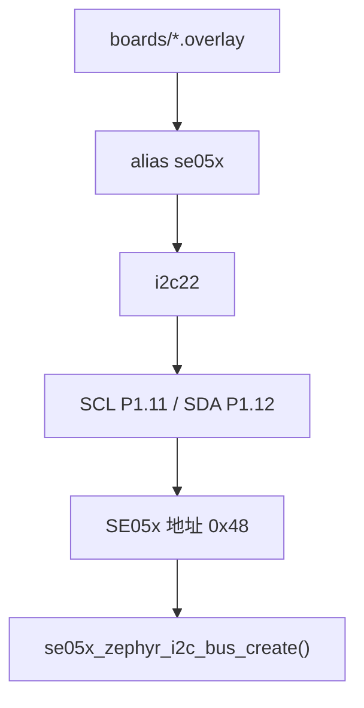

# boards 子项目说明

`boards/` 目录存放 nRF54LM20 DK 的 devicetree overlay。当前工程通过 overlay 指定 SE05x 所在的 I2C 控制器、管脚、地址和 devicetree alias。

## 当前文件

| 文件 | 对应 board |
| --- | --- |
| `nrf54lm20dk_nrf54lm20a_cpuapp.overlay` | `nrf54lm20dk/nrf54lm20a/cpuapp` |
| `nrf54lm20dk_nrf54lm20b_cpuapp.overlay` | `nrf54lm20dk/nrf54lm20b/cpuapp` |

## 默认硬件连接

| 项目 | 默认值 |
| --- | --- |
| I2C 控制器 | `i2c22` |
| SCL | `P1.11` |
| SDA | `P1.12` |
| SE05x I2C 地址 | `0x48` |
| I2C 速率 | `100 kHz` |
| devicetree alias | `se05x` |

## overlay 关键逻辑

```dts
/ {
    aliases {
        se05x = &se05x;
    };
};

&i2c22 {
    status = "okay";
    clock-frequency = <I2C_BITRATE_STANDARD>;
    zephyr,concat-buf-size = <512>;

    se05x: se05x@48 {
        compatible = "nxp,se05x";
        status = "okay";
        reg = <0x48>;
    };
};
```

`src/main.c` 和 `se05x_bus` 不直接写死管脚，而是通过 `se05x` alias 找到 SE05x 节点。换管脚、换 I2C 实例或换地址时，优先改 overlay。

## I2C 时序路径



## 常见问题

### I2C ready 失败

优先检查：

- overlay 文件是否和当前 `BOARD` 匹配。
- `i2c22` 是否被其他外设占用。
- SCL/SDA 是否接反。
- SE05x 是否有供电和共地。
- I2C 上拉是否存在。
- SE05x 地址是否真的是 `0x48`。

### 能看到 I2C ready，但读不到 ATR

这通常说明 Zephyr 设备绑定成功，但 SE05x 没有正确响应 T=1 over I2C。重点检查：

- I2C 波形是否有 ACK。
- SE05x reset/上电时序是否正常。
- 线长和接触是否可靠。
- 是否使用了只能充电不能传数据的 USB 线导致 debug/download 异常。

### 为什么设置 `zephyr,concat-buf-size = <512>`

NXP T=1 over I2C 传输可能需要较长 buffer。这里给 Zephyr I2C concat buffer 留出空间，避免较长 APDU 帧在底层拼接时受限。
