# demo 子项目说明

`demo/` 目录存放所有直接和 SE05x 交互的示例。每个 demo 都使用 `se05x_demo_编号_名称.c` 的命名方式，方便和 README、串口日志、后续 ESP32/Nordic 对照保持一致。

当前 demo 的共同原则：

- Demo 00 是 UART 交互式安全 API 菜单，只包含读、查、随机数、状态和容量类接口。
- Demo 01-05 默认不写 SE05x persistent NVM。
- Demo 06/07 是写入型 demo，会写固定 demo object ID，已有对象时不覆盖。
- Demo 08 不新写对象，只复用 Demo 06/07 已准备好的 key 和 certificate。
- Demo 09 是钱包曲线研究 demo。它会先只读查询 secp256k1 状态；如果当前是 `NOT_SET`，会尝试写入 secp256k1 曲线参数到 SE05x persistent NVM；测试私钥使用 transient object，不写 persistent 私钥内容；运行前后只会清理自己的测试 object ID `0xEF090001`。
- 先验证安全会话，再调用 APDU/SSS API。
- 每个 demo 都输出 pass、skip、fail 统计，便于现场判断。
- 串口运行时输出统一使用英文 ASCII，避免串口终端编码不一致造成中文乱码；完整中文说明保留在 README 和源码注释中。

## Demo 总览

| 编号 | 文件 | 名称 | 场景 | 是否写 NVM |
| --- | --- | --- | --- | --- |
| 00 | `se05x_demo_00_uart_safe_api.c` | `uart_safe_api` | UART 交互式逐条测试安全 APDU API。 | 否 |
| 01 | `se05x_demo_01_safe_read_only.c` | `safe_read_only` | 首次 bring-up、完整只读冒烟测试。 | 否 |
| 02 | `se05x_demo_02_identity_random.c` | `identity_random` | 快速读取 SE 身份和随机数。 | 否 |
| 03 | `se05x_demo_03_inventory.c` | `inventory` | 查看能力、对象、曲线、crypto object 和空间。 | 否 |
| 04 | `se05x_demo_04_business_onboarding.c` | `business_onboarding` | 真实设备注册、产测上报、云端绑定前置流程。 | 否 |
| 05 | `se05x_demo_05_provisioning_check.c` | `provisioning_check` | 应用私钥、证书、TLS 身份写入前的业务预检。 | 否 |
| 06 | `se05x_demo_06_ecc_sign_verify.c` | `ecc_sign_verify` | SE 内 ECC 私钥签名、外部公钥验签。 | 是，写 `0xEF060001` |
| 07 | `se05x_demo_07_certificate_store.c` | `certificate_store` | 设备证书对象写入、回读和内容校验。 | 是，写 `0xEF070001` |
| 08 | `se05x_demo_08_tls_client_identity.c` | `tls_client_identity` | TLS 客户端身份材料检查和 handshake digest 签名。 | 否，复用 06/07 |
| 09 | `se05x_demo_09_wallet_curve_check.c` | `wallet_curve_check` | 验证 secp256k1 曲线能否启用，并用 transient key 做 ECDSA sign/verify。 | 可能写：仅在 secp256k1 为 `NOT_SET` 时写曲线参数；会清理 Demo09 专用测试 ID `0xEF090001` |

## 代码对应关系

| 文档章节 | 源码文件 | 入口函数 | 注册结构体 | 主要 API 类型 |
| --- | --- | --- | --- | --- |
| Demo 00 | `se05x_demo_00_uart_safe_api.c` | `run_uart_safe_api()` | `g_se05x_demo_uart_safe_api` | UART 菜单、版本、随机数、对象读取、对象检查、空间、列表、状态。 |
| Demo 01 | `se05x_demo_01_safe_read_only.c` | `run_safe_read_only()` | `g_se05x_demo_safe_read_only` | 版本、随机数、对象读取、对象检查、空间、列表、状态。 |
| Demo 02 | `se05x_demo_02_identity_random.c` | `run_identity_random()` | `g_se05x_demo_identity_random` | 版本、唯一 ID、随机数、状态。 |
| Demo 03 | `se05x_demo_03_inventory.c` | `run_inventory()` | `g_se05x_demo_inventory` | 版本能力、对象检查、空间、曲线、crypto object、对象列表。 |
| Demo 04 | `se05x_demo_04_business_onboarding.c` | `run_business_onboarding()` | `g_se05x_demo_business_onboarding` | 注册身份字段、Platform SCP 对象、注册 nonce、状态。 |
| Demo 05 | `se05x_demo_05_provisioning_check.c` | `run_provisioning_check()` | `g_se05x_demo_provisioning_check` | 写入前能力、保留对象、空间、曲线、crypto object、工站 nonce。 |
| Demo 06 | `se05x_demo_06_ecc_sign_verify.c` | `run_ecc_sign_verify()` | `g_se05x_demo_ecc_sign_verify` | persistent ECC key、transient public key、ECDSA sign/verify。 |
| Demo 07 | `se05x_demo_07_certificate_store.c` | `run_certificate_store()` | `g_se05x_demo_certificate_store` | persistent binary certificate object、write/read/compare。 |
| Demo 08 | `se05x_demo_08_tls_client_identity.c` | `run_tls_client_identity()` | `g_se05x_demo_tls_client_identity` | key/cert object check、certificate read、TLS digest sign。 |
| Demo 09 | `se05x_demo_09_wallet_curve_check.c` | `run_wallet_curve_check()` | `g_se05x_demo_wallet_curve_check` | ReadECCurveList、CreateCurve secp256k1、transient EC_NIST_K key、ECDSA sign/verify。 |

所有 demo 都通过 `demo/se05x_demo.c` 中的 demo catalog 注册，再由 `src/main.c` 根据 `APP_SELECTED_DEMO` 查找并调用 `demo->run(&s_boot_ctx)`。所以 README 中的流程图、demo 编号、源码文件和串口日志名称是一一对应的。

## 通用调用前置条件

所有 demo 运行前，`src/main.c` 已经完成：

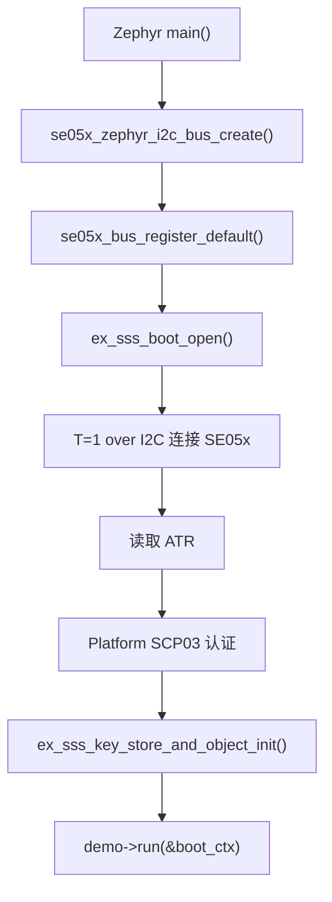

这个顺序的意义：

| 阶段 | 作用 |
| --- | --- |
| I2C bus create | 确认 Zephyr 能找到 SE05x 节点和 I2C controller。 |
| register default bus | 让 NXP hostlib 通过统一 bus contract 访问 Zephyr I2C。 |
| `ex_sss_boot_open()` | 建立 SE05x session，并完成 Platform SCP03。 |
| key store init | 为后续 key object、签名、加密类 demo 准备上下文。 |
| demo run | 只在安全会话成功后运行具体 APDU/SSS 调用。 |

## Demo 00：uart_safe_api

文件：`se05x_demo_00_uart_safe_api.c`

### 适用场景

这是一个串口交互式 API 测试台。它适合在 bring-up、调试、教学和现场排查时使用：不用为了测试一个接口反复修改 `main.c`，只要打开串口，在提示符后输入一个命令，就能立即调用对应 API 并看到返回值。

它回答的问题是：

- Platform SCP03 session 打开后，单个 API 能不能稳定返回。
- 哪个 API 在当前 SE052 applet/OEF 上可用，哪个会被权限或配置限制。
- 每个安全 API 的返回长度、状态字和数据 preview 是什么。
- 现场排查时，是链路问题、session 问题，还是某个具体 APDU 问题。

### 安全边界

Demo 00 **不写 SE05x NVM**，不会创建对象、不会写 key、不会写证书、不会删除对象、不会修改策略、不会修改生命周期，也不会做个性化。它只包含本工程已经在 Demo 01-05 中使用过的安全接口类别。

这里的“全部 API”指本工程当前已验证的安全 APDU 类接口，不是 NXP Plug & Trust hostlib 的全部函数。NXP 库里还有写入、删除、策略、生命周期、加密运算等接口，那些必须放到单独业务 demo 中，并明确 object ID、权限和恢复方案。

### 串口菜单

| 命令 | API | 作用 | 是否安全 |
| --- | --- | --- | --- |
| `AT+0` / `AT+H` | 无 | 重新打印菜单。 | 是 |
| `AT+1` | `Se05x_API_GetVersion()` | 读取 applet version、applet config 和 SecureBox 版本。 | 是 |
| `AT+2` | `Se05x_API_GetExtVersion()` | 读取扩展版本和配置字节。 | 是 |
| `AT+3` | `Se05x_API_GetRandom()` | 生成 16 字节随机数。 | 是 |
| `AT+4` | `Se05x_API_ReadObject(kSE05x_AppletResID_UNIQUE_ID)` | 读取芯片 UniqueID。 | 是 |
| `AT+5` | `Se05x_API_CheckObjectExists(kSE05x_AppletResID_UNIQUE_ID)` | 检查 UniqueID 保留对象。 | 是 |
| `AT+6` | `Se05x_API_CheckObjectExists(kSE05x_AppletResID_FEATURE)` | 检查 feature 保留对象。 | 是 |
| `AT+7` | `Se05x_API_CheckObjectExists(kSE05x_AppletResID_PLATFORM_SCP)` | 检查 Platform SCP 保留对象。 | 是 |
| `AT+8` | `Se05x_API_GetFreeMemory(kSE05x_MemoryType_PERSISTENT)` | 读取 persistent 剩余空间。 | 是 |
| `AT+9` | `Se05x_API_GetFreeMemory(kSE05x_MemoryType_TRANSIENT_RESET)` | 读取 reset transient 剩余空间。 | 是 |
| `AT+A` | `Se05x_API_GetFreeMemory(kSE05x_MemoryType_TRANSIENT_DESELECT)` | 读取 deselect transient 剩余空间。 | 是 |
| `AT+B` | `Se05x_API_ReadECCurveList()` | 读取 ECC 曲线列表，并解码 NIST、Brainpool、SecpK1 等 Weierstrass 曲线的 `SET/NOT_SET` 状态。 | 是 |
| `AT+C` | `Se05x_API_ReadCryptoObjectList()` | 读取 crypto object 列表。 | 是 |
| `AT+D` | `Se05x_API_ReadState()` | 读取 applet 状态摘要。 | 是 |
| `AT+E` | `Se05x_API_ReadIDList()` | 尝试读取对象 ID 列表；部分 OEF 可能不开放。 | 是，失败按 SKIP 看 |
| `AT+F` | Demo 00 内部安全探针 | 顺序执行 Demo 00 中全部安全查询/获取/只读探针 API，一次性输出能力报告。 | 是 |
| `AT+Q` | 无 | 退出 Demo 00，返回 `main.c` 关闭 session。 | 是 |

### 串口发送模式

推荐使用串口工具的 **text/文本发送模式**。例如要执行随机数接口，发送字符串 `AT+3`。命令后面可以带回车或换行，也可以不带；固件收到完整 `AT+X` 后会立即解析并执行。固定前缀可以让固件按字符串命令处理，避免单字节输入被串口工具的 text/hex 模式影响。

固件不会把重点放在串口字节编码上，而是直接打印本次命令对应的 API 调用和返回值：

```text
CMD AT+3 -> CALL Se05x_API_GetRandom(16)
OK   GetRandom sw=0x9000 len=16
     Random len=16 hex=AC 87 41 A7 ED 5D B4 BB 82 0D 4C B8 94 BD 85 B2
```

这里 `sw=0x9000` 表示 SE05x APDU 成功返回；`len=16` 表示返回 16 字节随机数；最后一行是随机数的实际字节值。随机数本身是二进制数据，所以用十六进制展示。

### API 流程

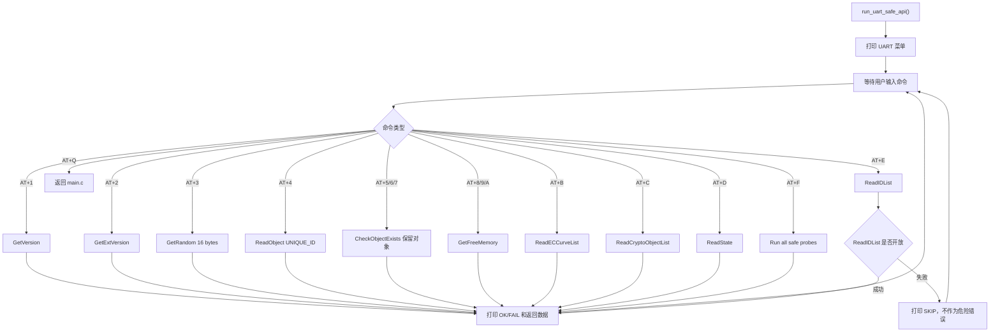

### 时序作用

Demo 00 的时序不是固定流水线，而是“session 打开后一直等待命令”。这对 debug 很有用：你可以先输入 `AT+1` 看版本，再输入 `AT+3` 连续观察随机数，再输入 `AT+4` 看 UniqueID，最后输入 `AT+B`、`AT+C`、`AT+D`、`AT+E` 看 applet 能力和状态。每一步都只触发一个 API，因此返回错误时定位范围非常小。

### 期望输出

```text
Demo 00 started. Type an AT command on UART. Type AT+0 or AT+H for help, AT+Q to quit.
se05x-safe-api> AT+1
CMD AT+1 -> CALL Se05x_API_GetVersion
OK   GetVersion sw=0x9000 len=7
     Applet version : 7.2.22
     Applet config  : 0x26F2
     SecureBox      : 255.255
se05x-safe-api> AT+3
CMD AT+3 -> CALL Se05x_API_GetRandom(16)
OK   GetRandom sw=0x9000 len=16
     Random len=16 hex=AC 87 41 A7 ED 5D B4 BB 82 0D 4C B8 94 BD 85 B2
se05x-safe-api> AT+E
CMD AT+E -> CALL Se05x_API_ReadIDList
SKIP ReadIDList sw=0xFFFF; this API may be disabled by the current applet/OEF.
```

## Demo 01：safe_read_only

文件：`se05x_demo_01_safe_read_only.c`

### 适用场景

这是最完整的只读冒烟测试。建议第一次接好 SE05x、换线、换板、换 overlay、改 SCP03 profile 或移植 hostlib 后优先运行它。

它回答的问题是：

- I2C 是否通。
- ATR 是否能读到。
- Platform SCP03 是否能打开。
- applet 版本是否能读到。
- SE05x random、unique ID、object check、memory、curve list、state 等只读能力是否能用。

### 使用到的 SE05x 功能和 API

| 功能 | API | 作用 |
| --- | --- | --- |
| applet 版本 | `Se05x_API_GetVersion()` | 确认 applet 存在，读取版本和能力 bitmap。 |
| 扩展版本 | `Se05x_API_GetExtVersion()` | 读取更完整的 version/config 数据。 |
| 随机数 | `Se05x_API_GetRandom()` | 验证 SE05x 内部随机数能力。 |
| 唯一 ID | `Se05x_API_ReadObject(kSE05x_AppletResID_UNIQUE_ID)` | 读取芯片唯一身份。 |
| 对象存在检查 | `Se05x_API_CheckObjectExists()` | 检查 unique ID、feature、platform SCP 等保留对象。 |
| 空间读取 | `Se05x_API_GetFreeMemory()` | 读取 persistent 和 transient 空间。 |
| 对象列表 | `Se05x_API_ReadIDList()` | 尝试枚举对象 ID，失败时当前按 skip 处理。 |
| ECC 曲线 | `Se05x_API_ReadECCurveList()` | 查看 ECC curve 列表。 |
| crypto object | `Se05x_API_ReadCryptoObjectList()` | 查看临时 crypto object 状态。 |
| SE 状态 | `Se05x_API_ReadState()` | 读取 SE 状态摘要。 |

### API 流程

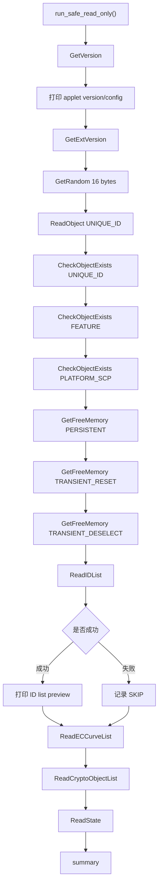

### 时序作用

Demo 01 从最基础的版本读取开始，再逐步进入对象、空间、列表和状态读取。这样如果失败，日志位置可以直接说明问题层级：

- `GetVersion` 失败：优先看 I2C、T=1 over I2C、SCP03 session。
- `GetRandom` 失败：优先看 SE05x random APDU 或 session 状态。
- `ReadObject(UNIQUE_ID)` 失败：优先看对象读取权限或 object ID。
- 只有 `ReadIDList` skip：基础链路已成立，当前不作为 bring-up 失败。

### 期望输出

```text
SAFE_TEST begin: read-only, no NVM writes, no object creation
Applet version: 7.2.22
SAFE_TEST PASS GetVersion
SAFE_TEST PASS GetExtVersion
SAFE_TEST PASS GetRandom
SAFE_TEST PASS ReadObject(UNIQUE_ID)
SAFE_TEST summary: pass=13 skip=1 fail=0
SAFE_TEST overall OK
```

## Demo 02：identity_random

文件：`se05x_demo_02_identity_random.c`

### 适用场景

这是快速检查 demo，适合日常调试。它不做完整 inventory，只确认当前 SE05x 的身份和随机数接口是否稳定。

适合：

- 烧录后快速确认 SE 在线。
- 产测时读取 unique ID。
- 确认连续多次 random 调用不是固定输出。
- 为后续设备注册、云端绑定、证书流程提供身份读取基础。

### 使用到的 SE05x 功能和 API

| 功能 | API | 代码位置 | 作用 |
| --- | --- | --- | --- |
| applet 版本 | `Se05x_API_GetVersion()` | `demo_get_version()` | 先确认 APDU 通路和 applet 响应正常，同时打印版本。 |
| 唯一 ID | `Se05x_API_ReadObject(kSE05x_AppletResID_UNIQUE_ID)` | `demo_read_unique_id()` | 读取 SE05x 芯片唯一身份，可用于设备绑定、产测记录或云端注册。 |
| 随机数 | `Se05x_API_GetRandom()` | `demo_get_random()` | 连续读取 3 组 16 字节随机数，确认 SE 随机数服务可重复调用。 |
| SE 状态 | `Se05x_API_ReadState()` | `demo_read_state()` | 读取状态摘要，作为快速检查最后的状态闭环。 |

### API 流程

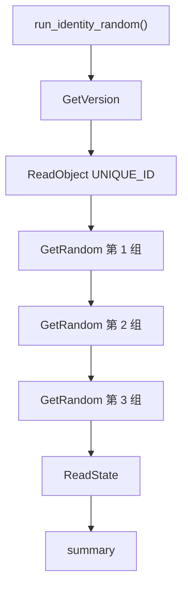

### 时序作用

先读版本是为了确认 APDU 通道正常；随后读 unique ID 确认设备身份；再连续读三组随机数，确认 random 服务可重复调用；最后读 state 给日志一个状态闭环。

这个顺序和代码中的 `run_identity_random()` 保持一致。它比 Demo 01 更短，适合日常快速检查；如果 Demo 02 通过但 Demo 01 后半段失败，通常说明基础 session 没问题，问题更可能在对象列表、空间查询或某个高级只读 API。

### 期望输出

```text
IDENTITY_RANDOM begin
Applet version: 7.2.22
UniqueID len=18 preview=...
Random[0] len=16 preview=...
Random[1] len=16 preview=...
Random[2] len=16 preview=...
IDENTITY_RANDOM summary: pass=... skip=0 fail=0
Demo identity_random 总体结果：OK
```

## Demo 03：inventory

文件：`se05x_demo_03_inventory.c`

### 适用场景

这是能力和资源盘点 demo，适合在准备增加写入型示例之前运行。

它重点确认：

- 当前 applet 开启了哪些能力。
- 保留对象是否存在。
- persistent/transient 空间剩余多少。
- ECC curve 和 crypto object 状态如何。

### 使用到的 SE05x 功能和 API

| 功能 | API | 代码位置 | 作用 |
| --- | --- | --- | --- |
| applet 版本和能力 | `Se05x_API_GetVersion()` | `inventory_get_version()` | 读取 applet version/config，并解析 ECDSA、HMAC、RSA、AES、TLS 等能力位。 |
| 对象存在检查 | `Se05x_API_CheckObjectExists()` | `inventory_check_object()` | 检查 `UNIQUE_ID`、`FEATURE`、`PLATFORM_SCP` 等保留对象是否存在。 |
| persistent 空间 | `Se05x_API_GetFreeMemory(kSE05x_MemoryType_PERSISTENT)` | `inventory_free_memory()` | 判断后续是否有空间创建长期保存的 key、证书或数据对象。 |
| transient reset 空间 | `Se05x_API_GetFreeMemory(kSE05x_MemoryType_TRANSIENT_RESET)` | `inventory_free_memory()` | 查看 reset 后释放的临时空间。 |
| transient deselect 空间 | `Se05x_API_GetFreeMemory(kSE05x_MemoryType_TRANSIENT_DESELECT)` | `inventory_free_memory()` | 查看 deselect 后释放的临时空间。 |
| ECC 曲线列表 | `Se05x_API_ReadECCurveList()` | `inventory_curve_list()` | 查看当前 applet 中 ECC curve 的启用状态。 |
| crypto object 列表 | `Se05x_API_ReadCryptoObjectList()` | `inventory_crypto_object_list()` | 查看临时 crypto object 列表，正常为空也可以是有效状态。 |
| 对象 ID 列表 | `Se05x_API_ReadIDList()` | `inventory_id_list()` | 尝试枚举对象 ID；当前放在最后，失败时可按 skip 处理。 |

### API 流程

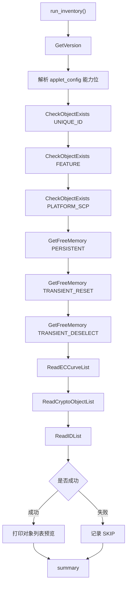

### 时序作用

Demo 03 先看 applet 能力，再看保留对象，再看空间，最后看列表。`ReadIDList` 放在最后，是因为它在某些 SE 配置下可能不开放，不能让它影响前面更关键的能力判断。

这个顺序和代码中的 `run_inventory()` 保持一致。它适合在增加写入型 demo 前运行，因为写 key、导证书、做 TLS 身份前，必须先知道当前 SE 是否具备对应算法能力、保留对象是否正常、persistent 空间是否足够。

### 期望输出

```text
INVENTORY begin
Applet version: 7.2.22
ECDSA_ECDH_ECDHE  : yes
HMAC              : yes
RSA_PLAIN         : yes
AES               : yes
TLS               : yes
GetFreeMemory(PERSISTENT) free=...
ReadECCurveList len=...
ReadCryptoObjectList len=...
INVENTORY summary: pass=... skip=... fail=0
Demo inventory 总体结果：OK
```

## Demo 04：business_onboarding

文件：`se05x_demo_04_business_onboarding.c`

### 真实业务场景

这是设备注册、产测上报、云端绑定前的真实业务流程 demo。它不是单纯测试某个 API，而是模拟产品里常见的第一阶段注册材料采集：

- 设备第一次上电后，读取 SE05x 唯一 ID。
- 读取 applet version/config，确认当前安全芯片型号和能力。
- 确认 Platform SCP 对象存在，说明当前 secure channel 的基础对象可见。
- 从 SE05x 生成注册 nonce，真实业务里可用于防重放、注册请求关联或产测记录。
- 读取 SE state，作为诊断字段。

当前仍使用官方/default Platform SCP03 key/profile，不改安全配置，不写 SE05x NVM。真实量产时，后续还应该增加“SE 内应用私钥签名云端 challenge”的步骤，用来证明应用私钥确实在 SE 内且不可导出。

### 使用到的 SE05x 功能和 API

| 功能 | API | 代码位置 | 真实业务作用 |
| --- | --- | --- | --- |
| applet 版本和能力 | `Se05x_API_GetVersion()` | `onboarding_get_version()` | 注册记录里保存 SE applet 版本、能力位、SCP03 profile，方便云端和产线追踪。 |
| 设备唯一身份 | `Se05x_API_ReadObject(kSE05x_AppletResID_UNIQUE_ID)` | `onboarding_read_unique_id()` | 作为设备注册主身份之一，可和 MCU SN、PCB SN、证书序列号做绑定。 |
| Platform SCP 对象检查 | `Se05x_API_CheckObjectExists(kSE05x_AppletResID_PLATFORM_SCP)` | `onboarding_check_platform_scp()` | 确认当前用于安全通道的保留对象存在，避免把未正确配置的 SE 放入业务链路。 |
| 注册 nonce | `Se05x_API_GetRandom()` | `onboarding_get_registration_nonce()` | 生成 32 字节注册随机数，真实业务里可用于防重放、注册事务 ID 或 challenge。 |
| SE 状态 | `Se05x_API_ReadState()` | `onboarding_read_state()` | 记录 SE 状态摘要，便于产测和售后诊断。 |

### API 流程

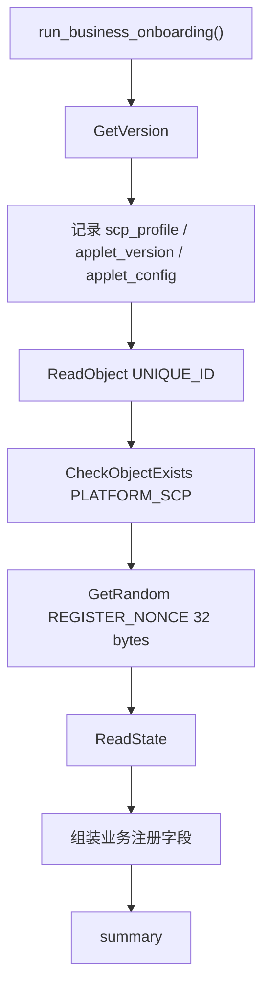

### 真实产品中的位置

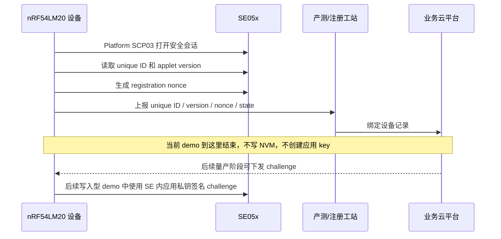

### 期望输出

```text
BUSINESS_ONBOARDING 开始
Business field: se_profile=SE052_B501
Business field: applet_version=7.2.22
Business field: device_unique_id
UniqueID len=18 preview=...
Business field: platform_scp_object=present
Business field: registration_nonce
RegisterNonce len=32 preview=...
Business field: se_state
BUSINESS_ONBOARDING summary: pass=... skip=... fail=0
Demo business_onboarding 总体结果：OK
```

## Demo 05：provisioning_check

文件：`se05x_demo_05_provisioning_check.c`

### 真实业务场景

这是应用私钥、证书、TLS 身份或业务密钥写入 SE05x 之前的真实业务预检流程。真实产线在写入之前，不应该直接创建对象，而是先确认：

- 当前 SE applet 支持目标算法能力。
- Platform SCP03 通道和保留对象正常。
- persistent 空间足够保存应用 key、证书或数据对象。
- transient 空间和 crypto object 状态正常。
- ECC curve 列表可读，后续可以选择合适曲线。
- 工站有随机 nonce 可把本次写入动作和产测记录绑定。

当前 demo 仍不写 SE05x NVM，不创建 key，不导证书。它只做真实 provisioning 工站的“写入前检查”阶段。

### 使用到的 SE05x 功能和 API

| 功能 | API | 代码位置 | 真实业务作用 |
| --- | --- | --- | --- |
| applet 版本和能力 | `Se05x_API_GetVersion()` | `provisioning_get_version()` | 判断是否支持 ECDSA、HMAC、RSA、AES、TLS 等后续业务能力。 |
| Platform SCP 对象 | `Se05x_API_CheckObjectExists(kSE05x_AppletResID_PLATFORM_SCP)` | `provisioning_check_object()` | 确认安全通道基础对象存在。 |
| feature 对象 | `Se05x_API_CheckObjectExists(kSE05x_AppletResID_FEATURE)` | `provisioning_check_object()` | 确认 feature 保留对象存在。 |
| persistent 空间 | `Se05x_API_GetFreeMemory(kSE05x_MemoryType_PERSISTENT)` | `provisioning_free_memory()` | 判断是否有空间保存长期 key、证书或业务对象。 |
| transient reset 空间 | `Se05x_API_GetFreeMemory(kSE05x_MemoryType_TRANSIENT_RESET)` | `provisioning_free_memory()` | 判断临时运算上下文空间是否正常。 |
| transient deselect 空间 | `Se05x_API_GetFreeMemory(kSE05x_MemoryType_TRANSIENT_DESELECT)` | `provisioning_free_memory()` | 判断 deselect 生命周期的临时空间是否正常。 |
| ECC 曲线列表 | `Se05x_API_ReadECCurveList()` | `provisioning_curve_list()` | 为后续 ECC key、CSR、ECDSA 签名选择曲线做准备。 |
| crypto object 列表 | `Se05x_API_ReadCryptoObjectList()` | `provisioning_crypto_object_list()` | 确认当前临时 crypto object 状态，避免工站流程残留状态影响写入。 |
| 工站 nonce | `Se05x_API_GetRandom()` | `provisioning_generate_csr_nonce()` | 生成本次 provisioning/CSR 事务 nonce，后续可写入产测记录。 |

### API 流程

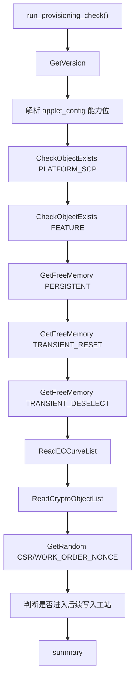

### 真实产品中的位置

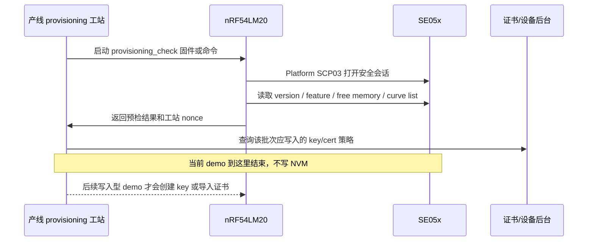

### 期望输出

```text
PROVISIONING_CHECK 开始
Provisioning field: scp_profile=SE052_B501
Provisioning field: applet_version=7.2.22
ECDSA_ECDH_ECDHE  : yes
AES               : yes
TLS               : yes
CheckObjectExists(PLATFORM_SCP) exists=yes
GetFreeMemory(PERSISTENT) free=...
CurveList len=...
CryptoObjectList len=...
ProvisioningNonce len=16 preview=...
PROVISIONING_CHECK summary: pass=... skip=... fail=0
Demo provisioning_check 总体结果：OK
```

## Demo 06：ecc_sign_verify

文件：`se05x_demo_06_ecc_sign_verify.c`

### 真实业务场景

这是第一个真正使用 SE05x 应用私钥的业务 demo。它模拟设备注册、云端绑定、TLS 客户端认证中最核心的动作：私钥留在 SE05x 内，外部只给 32 字节 challenge digest，SE05x 返回 ECDSA 签名，外部用公钥验签。

当前 demo 会写 SE05x persistent NVM：

| 项目 | 值 |
| --- | --- |
| 私钥 object ID | `0xEF060001` |
| 公钥 object ID | `0xEF060002`，transient，session 结束后消失 |
| 曲线 | NIST P-256 |
| 私钥来源 | NXP 示例 P-256 demo 私钥，只用于开发验证 |
| 私钥源码变量 | `k_demo_ec_key_pair_der`，位于 `se05x_demo_06_ecc_sign_verify.c` |
| 公钥源码变量 | `k_demo_ec_public_key_der`，位于 `se05x_demo_06_ecc_sign_verify.c` |
| challenge digest 变量 | `k_demo_digest`，模拟云端 challenge 或 TLS transcript hash |
| 覆盖策略 | 已存在时不覆盖，只 `sss_key_object_get_handle()` 复用 |
| 生产替换 | 量产时应改为工站注入或 SE 内生成，不应使用仓库里的 demo 私钥 |

### 使用到的 SE05x/SSS 功能和 API

| 功能 | API | 代码位置 | 真实业务作用 |
| --- | --- | --- | --- |
| 对象存在检查 | `Se05x_API_CheckObjectExists()` | `prepare_demo_key()` | 写入前确认 `0xEF060001` 是否已存在，避免覆盖。 |
| key object 初始化 | `sss_key_object_init()` | `prepare_demo_key()` | 把 `sss_object_t` 绑定到当前 key store。 |
| 分配持久私钥对象 | `sss_key_object_allocate_handle()` | `prepare_demo_key()` | 为 demo 私钥分配 persistent object handle。 |
| 写入 demo 私钥 | `sss_key_store_set_key()` | `prepare_demo_key()` | 首次运行时把 P-256 demo key 写入 SE05x。 |
| 复用已有私钥 | `sss_key_object_get_handle()` | `prepare_demo_key()` | 再次运行时获取已有对象，不覆盖。 |
| 签名上下文 | `sss_asymmetric_context_init()` | `sign_and_verify()` | 准备 ECDSA sign/verify context。 |
| SE 内签名 | `sss_asymmetric_sign_digest()` | `sign_and_verify()` | 用 SE 内私钥签名 challenge digest。 |
| 公钥验签 | `sss_asymmetric_verify_digest()` | `sign_and_verify()` | 验证签名和 demo 公钥匹配。 |

### API 流程

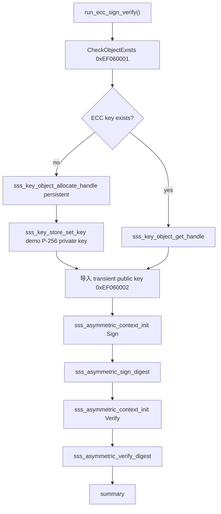

### 期望输出

```text
ECC_SIGN_VERIFY 开始
会写 persistent NVM：object_id=0xEF060001；已有对象时不覆盖
ECC key object_id=0xEF060001 exists=no
ECC persistent key created=yes object_id=0xEF060001
Signature len=... preview=...
ECC_SIGN_VERIFY 汇总：pass=... skip=0 fail=0
Demo ecc_sign_verify 总体结果：OK
```

## Demo 07：certificate_store

文件：`se05x_demo_07_certificate_store.c`

### 真实业务场景

这是设备证书写入和回读校验 demo。真实 mTLS/TLS client authentication 中，设备需要把证书或证书链发给服务器，而私钥留在 SE05x 内部。本 demo 写入一个和 Demo 06 demo 私钥匹配的自签 DER 证书，用来验证“证书对象能持久保存、能回读、内容没有被截断或改写”。

当前 demo 会写 SE05x persistent NVM：

| 项目 | 值 |
| --- | --- |
| 证书 object ID | `0xEF070001` |
| 对象类型 | SSS binary object |
| 证书格式 | DER demo certificate，长度 408 字节 |
| 证书源码变量 | `k_demo_device_cert_der`，位于 `se05x_demo_07_certificate_store.c` |
| 覆盖策略 | 已存在时不覆盖，只回读比较 |
| 冲突处理 | 已存在但内容不同会 FAIL，提醒不要覆盖未知对象 |
| 生产替换 | 量产时应替换为 CA/工站签发的设备证书或证书链 |

### 使用到的 SE05x/SSS 功能和 API

| 功能 | API | 代码位置 | 真实业务作用 |
| --- | --- | --- | --- |
| 对象存在检查 | `Se05x_API_CheckObjectExists()` | `prepare_certificate_object()` | 写入前确认 `0xEF070001` 是否已存在。 |
| 分配 binary object | `sss_key_object_allocate_handle()` | `prepare_certificate_object()` | 创建 persistent certificate/binary object。 |
| 写入证书 | `sss_key_store_set_key()` | `prepare_certificate_object()` | 首次运行写入 DER demo certificate。 |
| 回读证书 | `sss_key_store_get_key()` | `read_and_verify_certificate()` | 模拟 TLS 发送证书前从 SE05x 读取证书。 |
| 内容校验 | `memcmp()` | `read_and_verify_certificate()` | 确认证书对象内容和 demo 证书一致。 |

### API 流程

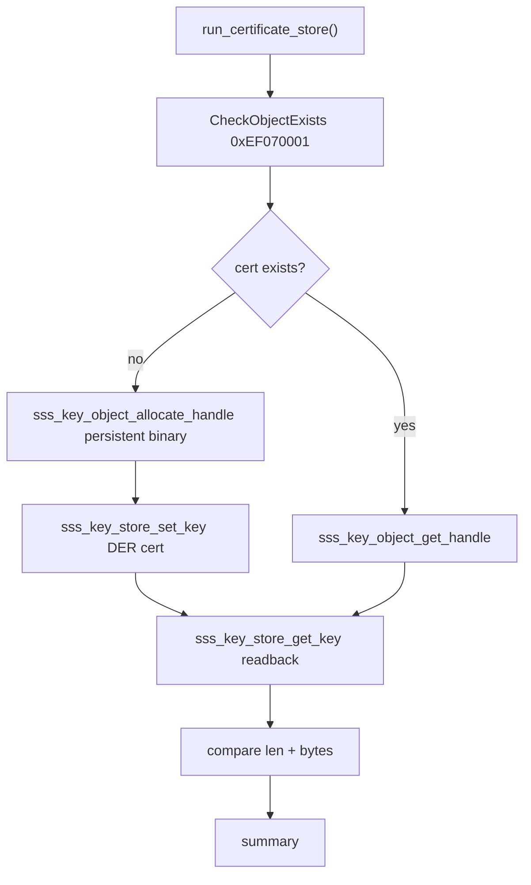

### 期望输出

```text
CERTIFICATE_STORE 开始
会写 persistent NVM：object_id=0xEF070001；已有对象时不覆盖
Certificate object_id=0xEF070001 exists=no
Certificate persistent object created=yes object_id=0xEF070001
Certificate readback len=408 bit_len=3264
CERTIFICATE_STORE 汇总：pass=... skip=0 fail=0
Demo certificate_store 总体结果：OK
```

## Demo 08：tls_client_identity

文件：`se05x_demo_08_tls_client_identity.c`

### 真实业务场景

这是 TLS/mTLS 客户端身份 demo。它不直接接入 Zephyr socket TLS，而是把 TLS 客户端身份最关键的 SE05x 调用骨架单独跑通：

- 从 SE05x 读取设备证书，模拟 TLS `Certificate` 消息。
- 用 SE 内私钥签名 32 字节 handshake digest，模拟 TLS `CertificateVerify` 消息。

当前 demo 不新写 NVM。它依赖：

| 依赖对象 | 来源 | 作用 |
| --- | --- | --- |
| `0xEF060001` | Demo 06 | TLS client private key，SE 内签名。 |
| `0xEF070001` | Demo 07 | TLS client certificate，发给服务器。 |

### 使用到的 SE05x/SSS 功能和 API

| 功能 | API | 代码位置 | 真实业务作用 |
| --- | --- | --- | --- |
| key/cert 存在检查 | `Se05x_API_CheckObjectExists()` | `require_object()` | 确认 TLS 身份材料已经准备好。 |
| 加载私钥 handle | `sss_key_object_get_handle()` | `load_key_handle()` | 获取 SE 内 TLS 私钥对象。 |
| 读取证书 | `sss_key_store_get_key()` | `read_tls_certificate()` | 读取证书，模拟 TLS Certificate 发送。 |
| TLS digest 签名 | `sss_asymmetric_sign_digest()` | `sign_tls_handshake_digest()` | 用 SE 内私钥签名 handshake digest。 |

### API 流程

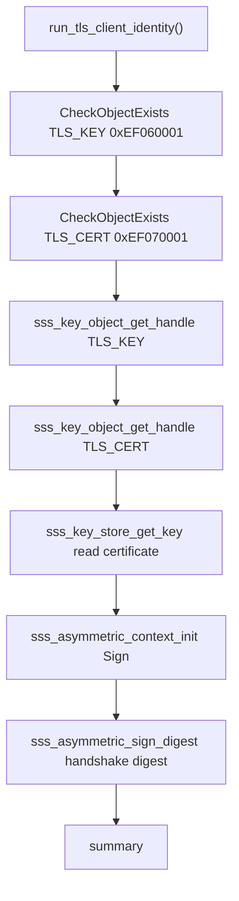

### 真实产品中的位置

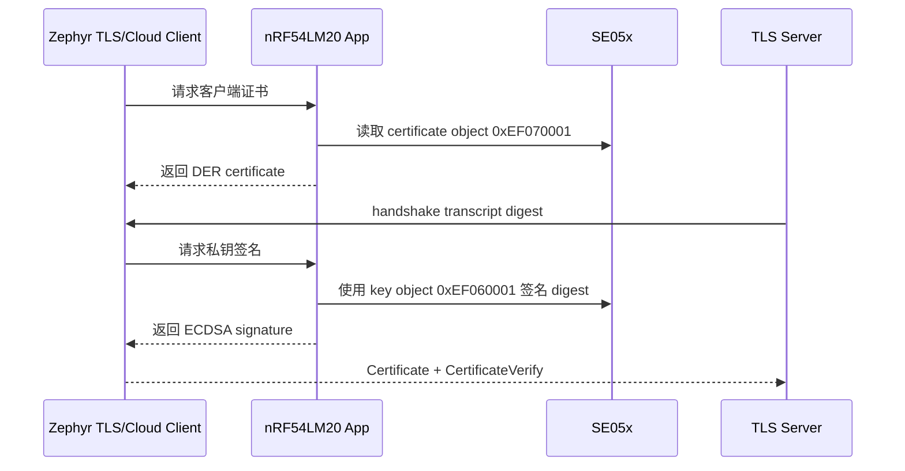

### 期望输出

```text
TLS_CLIENT_IDENTITY 开始
本 demo 不新写 NVM；依赖 key=0xEF060001 cert=0xEF070001
CheckObjectExists(TLS_KEY) object_id=0xEF060001 exists=yes
CheckObjectExists(TLS_CERT) object_id=0xEF070001 exists=yes
TLS certificate ready len=408 bit_len=3264
TLS CertificateVerify signature produced
TLS_CLIENT_IDENTITY 汇总：pass=... skip=0 fail=0
Demo tls_client_identity 总体结果：OK
```

## Demo 09：wallet_curve_check

文件：`se05x_demo_09_wallet_curve_check.c`

### 真实业务场景

这是硬件钱包方向的研究 demo，用来回答一个非常具体的问题：当前这颗 SE05x/SE052_B501 在当前 applet、OEF 和权限配置下，能不能从 `secp256k1 = NOT_SET` 走到可用状态，并进一步用 SE 原生 transient 私钥完成 ECDSA digest 签名和验签。

它不是完整 BTC/ETH 钱包 demo。它不解析 BTC transaction，不计算 double-SHA256，不做 Ethereum Keccak，不派生地址，不生成 recovery id，也不处理 low-S 规范化。它只验证最底层的 SE 能力：`secp256k1` 曲线是否能启用、SE 内是否能生成该曲线 key、是否能对 32 字节 digest 做 ECDSA sign/verify。

### NVM 风险边界

| 项目 | 说明 |
| --- | --- |
| 曲线参数 | 如果 Demo 00/`AT+B` 显示 `Secp256k1 : NOT_SET`，Demo 09 会调用 `Se05x_API_CreateCurve_secp256k1()`，这会写 SE05x persistent NVM。 |
| 重复运行 | 如果 secp256k1 已经是 `SET`，Demo 09 不重复创建曲线。 |
| 测试私钥 | 使用 `kKeyObject_Mode_Transient`，object ID 为 `0xEF090001`，不写 persistent 私钥内容。注意 SE05x transient object 的对象属性/ID 可能仍会保留，因此 demo 会清理自己的测试 ID。 |
| 删除动作 | Demo 09 不删除曲线、不 DeleteAll、不改生命周期、不改 policy；只会对保留的 Demo09 测试对象 `0xEF090001` 调用 `Se05x_API_DeleteSecureObject()`，避免重复运行时因为测试 ID 残留而失败。 |
| 风险最高的内容 | 生产环境真正必须备份和管控的是 SCP03 管理 key、object ID 映射、策略、证书/公钥登记记录。曲线参数本身不是业务私钥，但它会占用/改变 SE 的 persistent 配置。 |

### 使用到的 SE05x/SSS 功能和 API

| 功能 | API | 代码位置 | 真实业务作用 |
| --- | --- | --- | --- |
| 读取曲线状态 | `Se05x_API_ReadECCurveList()` | `read_secp256k1_status()` | 判断 `kSE05x_ECCurve_Secp256k1` 当前是 `SET` 还是 `NOT_SET`。 |
| 写入 secp256k1 曲线 | `Se05x_API_CreateCurve_secp256k1()` | `ensure_secp256k1_curve()` | 把 secp256k1 的 A/B/G/N/Prime 参数写入 SE，使后续 EC_NIST_K 256-bit key 有曲线基础。 |
| 测试 object ID 清理 | `Se05x_API_CheckObjectExists()` / `Se05x_API_DeleteSecureObject()` | `delete_wallet_test_object_if_exists()` | 只检查和清理 Demo09 保留测试 ID `0xEF090001`，不会碰其他业务对象。 |
| transient key 句柄 | `sss_key_object_allocate_handle()` | `generate_transient_key_and_sign()` | 分配 `kSSS_CipherType_EC_NIST_K`、`kSSS_KeyPart_Pair`、`kKeyObject_Mode_Transient` 的测试 key handle。 |
| SE 内生成测试 key | `sss_key_store_generate_key()` | `generate_transient_key_and_sign()` | 在 SE 内生成 secp256k1 测试私钥，私钥不导出。 |
| SE 内签名 | `sss_asymmetric_sign_digest()` | `generate_transient_key_and_sign()` | 对固定 32 字节 digest 生成 ECDSA signature。 |
| 验证签名 | `sss_asymmetric_verify_digest()` | `generate_transient_key_and_sign()` | 验证生成的签名和测试 key 匹配，证明 sign/verify 链路成立。 |

### API 流程

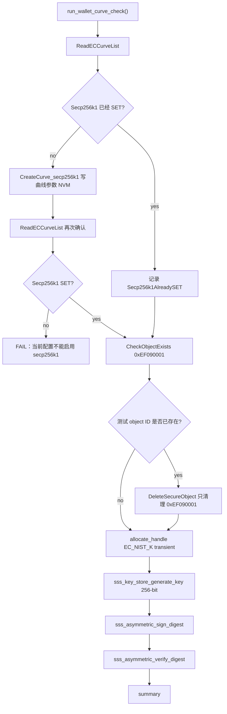

### 结果怎么判断

| 结果 | 含义 |
| --- | --- |
| `CreateCurve_secp256k1` 失败 | 当前 OEF、权限或 applet 配置不允许应用侧启用 secp256k1；这颗 SE 当前不能直接走 SE 原生 BTC/ETH secp256k1 私钥签名。 |
| 曲线 `SET` 但 `GenerateKey` 失败 | 曲线列表能打开，但 SSS key generation 或 EC_NIST_K 映射仍不可用，需要继续查 hostlib 和 applet 权限。 |
| `GenerateKey` 成功但 `SignDigest` 失败 | key 可以生成，但签名链路不可用，仍不能作为钱包签名根能力。 |
| `SignDigest` 和 `VerifyDigest` 都成功 | SE 原生 secp256k1 ECDSA 基础链路成立。下一步才能做 BTC/ETH 钱包协议层。 |
| `DeleteSecureObject(WALLET_TEST_KEY)` 失败 | Demo09 专用测试 ID 无法清理，通常说明当前对象权限、session 或 SE 状态不允许删除；不要改成 DeleteAll，先单独排查该 object ID。 |

### 如果成功，BTC/ETH 是否就完美了

不是一步到位，但这是最关键的硬件能力门槛之一。Demo 09 如果通过，只说明 SE 可以原生持有 secp256k1 私钥并对 32 字节 digest 签名。完整 BTC/ETH 钱包还需要继续实现：

- BTC：交易解析、用户确认展示、double-SHA256、DER signature、sighash flag、地址格式、UTXO/path 管理。
- ETH：交易/RLP 或 typed transaction 解析、Keccak-256、`r/s/v` 输出、recovery id、EIP-155/1559 等规则。
- 安全交互：手机只提交待签名摘要或待解析交易，nRF 在本地显示关键信息并让用户确认，SE 只对确认后的 digest 签名。
- 生产密钥策略：SE 内生成或安全注入真实私钥；不要把生产私钥明文放在手机、固件或串口日志里。

### 期望输出

```text
WALLET_CURVE_CHECK started: secp256k1 curve enable + transient sign/verify
ReadECCurveList len=17 Secp256k1=NOT_SET
Secp256k1 is NOT_SET; creating curve will write SE05x persistent NVM once
SAFE_TEST PASS CreateCurve_secp256k1
ReadECCurveList len=17 Secp256k1=SET
SAFE_TEST PASS GenerateKey(SECP256K1_TRANSIENT)
Secp256k1Signature len=...
SAFE_TEST PASS SignDigest(SECP256K1)
SAFE_TEST PASS VerifyDigest(SECP256K1)
WALLET_CURVE_CHECK summary: pass=... skip=0 fail=0
```

## 写入型 demo 安全说明

### 写 NVM 后是不是只要有密钥就 OK

不完全是。这里要分清几类密钥和记录：

| 密钥/记录 | 作用 | 丢失后影响 |
| --- | --- | --- |
| Platform SCP03 key | 用来打开管理/平台安全通道。当前工程先使用官方/default 配置。 | 如果生产后换成自有 SCP03 key 且丢失，可能无法再管理、更新、删除或重新 provision 对象。 |
| SE 内应用私钥 | 用于设备签名、TLS client auth、业务认证。通常不可导出。 | 如果对象被删或 SE 损坏，设备身份无法恢复，只能重新注册或报废该身份。 |
| 对象访问策略 | 决定对象能否读、写、删除、使用、认证后使用。 | 策略写错可能导致对象不能更新、不能删除或不能按预期使用。 |
| object ID 映射表 | 记录每个业务对象写在哪个 ID。 | 丢失映射会导致后续升级、删除、证书轮换非常危险。 |
| 云端绑定记录 | 记录 unique ID、公钥、证书序列号和业务账号关系。 | SE 里对象还在，但云端可能不认这台设备。 |

所以不是“有密钥就一定 OK”。真实量产至少要保存：

1. SCP03 key 或能重新建立管理会话的凭据。
2. 每个 object ID 的用途、策略、生命周期和版本。
3. 设备 unique ID、证书序列号、公钥摘要、云端绑定记录。
4. 工站写入日志和失败恢复策略。

### 密钥丢了是不是 SE 就废了

看丢的是哪一个：

- **丢了 Platform SCP03 管理 key**：SE 不一定物理报废，但后续可能无法重新 provision、删除对象、轮换证书或恢复出厂。对生产来说，这颗设备可能等同不可维护。
- **丢了云端登记记录**：SE 里对象还在，但云端不认它，业务身份可能需要重新注册。
- **丢了应用私钥备份**：正常情况下应用私钥本来就不应该有明文备份；如果私钥只存在 SE 内，这是安全设计。真正要备份的是公钥、证书、object ID 和注册关系。
- **写错对象策略且没有删除权限**：这最危险，可能导致对象占住 NVM，后续无法覆盖，只能换 object ID，严重时影响量产一致性。

### 写入型 demo 的安全规则

写入型 demo 合入前必须满足：

1. 默认不覆盖已有生产 object ID。
2. object ID 使用 `DEMO_` 或测试范围，并在 README 中明确列出。
3. 首次写入前先 `CheckObjectExists()`。
4. 如果对象已存在，默认退出，不自动覆盖。
5. 单独提供清理 demo 或清理开关，不能默认删除。
6. 串口日志必须打印 object ID、策略、是否 persistent、是否可删除。
7. README 必须写清“这个 demo 会写 NVM”。
8. 生产 key 和测试 key 必须分开，不能把生产 key 写死进仓库。

## 新增 demo 规范

新增 demo 时建议遵循：

1. 文件名使用 `se05x_demo_xx_xxx.c`，例如 `se05x_demo_06_ecc_sign_verify.c`。
2. 在 `se05x_demo.h` 中添加枚举。
3. 在 `se05x_demo.c` 的 catalog 中注册。
4. 在根 `CMakeLists.txt` 中加入源文件。
5. 在本 README 中补充场景、时序作用、API 流程和预期输出。

如果 demo 会写 SE05x NVM，必须在文件头和 README 中明确说明：

- 会创建哪些 object ID。
- 是否覆盖已有对象。
- 是否写 persistent NVM。
- 如何清理。
- 失败后如何恢复。
