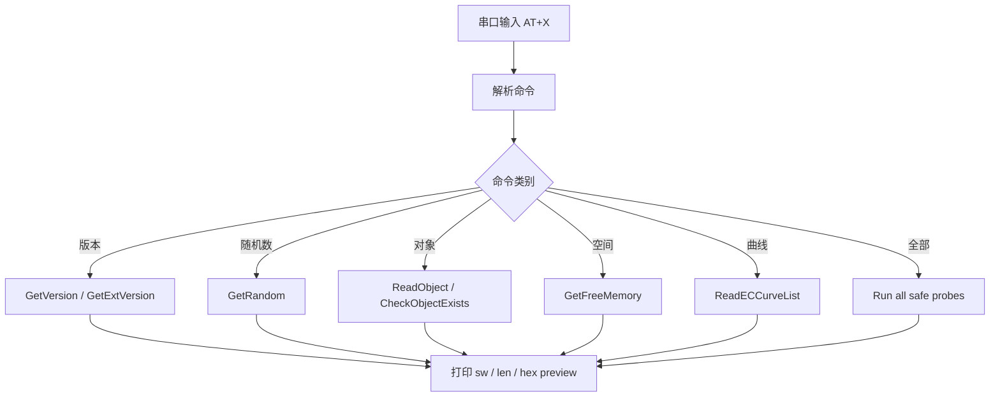
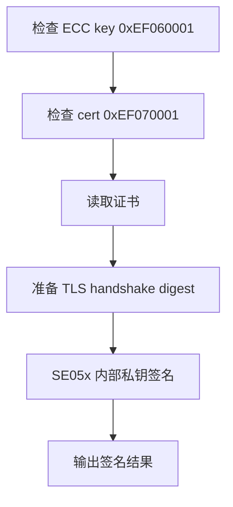
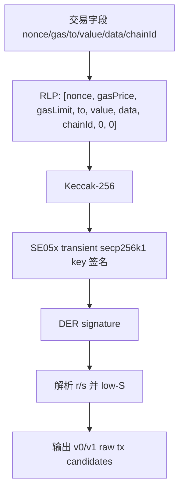
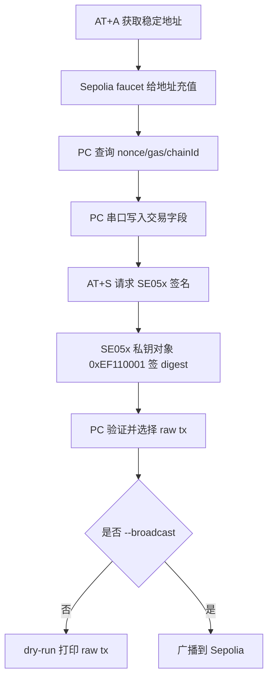

# demo 子项目说明

`demo/` 目录存放所有直接和 SE05x 交互的示例。命名规则是：

```text
se05x_demo_编号_名称.c
```

每个 demo 都通过 `demo/se05x_demo.c` 注册到 catalog，再由 `src/main.c` 的 `APP_SELECTED_DEMO` 选择运行。

## 总原则

- 串口运行时只输出英文 ASCII，避免中文乱码。
- 中文解释写在 README 和源码注释里。
- Demo00-Demo05 是安全只读/查询类流程，不写 SE05x persistent NVM。
- Demo06-Demo08 是应用 key、证书、TLS 身份材料演示。
- Demo09 验证当前 SE05x 是否能启用 secp256k1，并做临时 key 签名验签。
- Demo10 演示 ETH legacy 交易签名数学链路，但使用临时 key，地址每次可能变化，不适合真实测试网转账。
- Demo11 使用 SE05x 持久化 key，输出稳定地址，适合 Sepolia 测试网 dry-run 和显式广播验证。

## Demo 总览

| 编号 | 文件 | 名称 | 场景 | 是否写 NVM |
| --- | --- | --- | --- | --- |
| 00 | `se05x_demo_00_uart_safe_api.c` | `uart_safe_api` | UART 菜单逐条测试安全查询 API。 | 否 |
| 01 | `se05x_demo_01_safe_read_only.c` | `safe_read_only` | 首次 bring-up 完整只读冒烟测试。 | 否 |
| 02 | `se05x_demo_02_identity_random.c` | `identity_random` | 读取版本、UniqueID、随机数。 | 否 |
| 03 | `se05x_demo_03_inventory.c` | `inventory` | 查看能力、曲线、crypto object、空间状态。 | 否 |
| 04 | `se05x_demo_04_business_onboarding.c` | `business_onboarding` | 设备注册、产测上报、云端绑定前置流程。 | 否 |
| 05 | `se05x_demo_05_provisioning_check.c` | `provisioning_check` | 应用 key/证书写入前的业务预检。 | 否 |
| 06 | `se05x_demo_06_ecc_sign_verify.c` | `ecc_sign_verify` | 写入/复用 demo ECC 私钥并签名验签。 | 是，`0xEF060001` |
| 07 | `se05x_demo_07_certificate_store.c` | `certificate_store` | 写入/复用 demo 设备证书并回读校验。 | 是，`0xEF070001` |
| 08 | `se05x_demo_08_tls_client_identity.c` | `tls_client_identity` | 复用 06/07，模拟 TLS 客户端身份。 | 不新写 |
| 09 | `se05x_demo_09_wallet_curve_check.c` | `wallet_curve_check` | 验证 secp256k1 曲线和 SE 内签名能力。 | 曲线未启用时写一次；测试对象 `0xEF090001` 会清理 |
| 10 | `se05x_demo_10_eth_wallet_sign.c` | `eth_wallet_sign` | ETH legacy RLP、Keccak、临时 key 签名、raw tx 候选输出。 | 曲线未启用时写一次；测试对象 `0xEF100001` 会清理 |
| 11 | `se05x_demo_11_eth_testnet_wallet.c` | `eth_testnet_wallet` | SE05x 持久化私钥签真实 Sepolia 交易字段。 | 是，钱包 key `0xEF110001` |

## Demo00：UART 安全 API 菜单

Demo00 用于现场排查和教学。它只调用安全查询类 API，不创建对象、不删除对象、不写 key、不写证书。

常用命令：

| 命令 | API | 作用 |
| --- | --- | --- |
| `AT+1` | `Se05x_API_GetVersion()` | 读取 applet 版本和能力 bitmap。 |
| `AT+2` | `Se05x_API_GetExtVersion()` | 读取扩展版本信息。 |
| `AT+3` | `Se05x_API_GetRandom()` | 从 SE05x 获取 16 字节随机数。 |
| `AT+4` | `Se05x_API_ReadObject(UNIQUE_ID)` | 读取芯片 UniqueID。 |
| `AT+B` | `Se05x_API_ReadECCurveList()` | 读取并解析曲线启用状态。 |
| `AT+F` | 内部探针 | 顺序跑完整安全查询 API。 |



## Demo01-Demo05：只读业务探针

这五个 demo 用于确定 SE05x 链路、能力和业务前置条件是否成立。

| Demo | 作用 | 典型结论 |
| --- | --- | --- |
| 01 | 完整只读冒烟测试 | I2C、T=1、SCP03、版本、随机数、对象、空间、曲线都能访问。 |
| 02 | 身份和随机数 | 可快速确认这颗 SE 的唯一身份和随机数输出。 |
| 03 | inventory | 可查看当前 OEF 暴露了哪些能力、哪些曲线已经启用。 |
| 04 | onboarding | 用于设备注册/产测时收集身份、随机数、状态。 |
| 05 | provisioning check | 写应用 key/证书前确认空间、曲线、保留对象和随机数能力。 |

## Demo06-Demo08：应用身份材料

Demo06 写入或复用一个 demo ECC 私钥对象 `0xEF060001`，并在 SE 内完成 digest 签名，再用公钥验签。

Demo07 写入或复用一个 demo 设备证书对象 `0xEF070001`，并回读校验内容。

Demo08 不新写对象，而是复用 Demo06 的 key 和 Demo07 的 certificate，模拟 TLS 客户端身份流程：



## Demo09：wallet_curve_check

Demo09 回答一个关键问题：当前 SE05x/SE052 是否能启用并使用 BTC/ETH 所需的 `secp256k1` 曲线。

流程：

1. `ReadECCurveList` 读取曲线列表。
2. 如果 `secp256k1` 是 `NOT_SET`，调用 `CreateCurve` 写入曲线参数，这一步会写 SE05x persistent NVM。
3. 使用测试对象 ID `0xEF090001` 分配 key handle。
4. 生成 secp256k1 临时测试 key。
5. 读取公钥，SE 内对 32 字节 digest 签名，并验签。
6. 测试结束删除 `0xEF090001`，避免留下测试对象。

Demo09 成功说明：这颗 SE05x 可以在 SE 内做 secp256k1 ECDSA 签名。这是 ETH/BTC 钱包方向成立的基础。

## Demo10：eth_wallet_sign

Demo10 是 ETH 签名链路研究 demo。它做完整 Ethereum legacy transfer 签名流程，但 key 是临时测试 key，不适合真实转账。

它验证：

- 交易字段如何编码为 legacy/EIP-155 signing RLP。
- Ethereum 使用 Keccak-256，不是 FIPS SHA3-256。
- SE05x 对 signing hash 做 secp256k1 ECDSA 签名。
- nRF 从公钥推导 ETH 地址。
- nRF 从 DER 签名解析 `r/s`，并做 low-S 归一化。
- 因 SE05x 不返回 recovery id，固件输出两个 `v` 候选和两个 raw transaction 候选。



## Demo11：eth_testnet_wallet

Demo11 是当前最接近真实钱包的测试网流程。它和 Demo10 的关键区别是：Demo11 使用 SE05x persistent key object `0xEF110001`，所以地址稳定，可以给这个地址打 Sepolia 测试币，然后签真实测试网交易字段。

### 串口命令

| 命令 | 作用 |
| --- | --- |
| `AT+A` | 创建或复用钱包 key `0xEF110001`，输出稳定 `ETH_FROM_ADDRESS`。 |
| `AT+P` | 打印当前交易字段。 |
| `AT+R` | 重置为 Sepolia 示例字段。 |
| `AT+N=<decimal>` | 设置 nonce。 |
| `AT+G=<decimal>` | 设置 gasPrice，单位 wei。 |
| `AT+L=<decimal>` | 设置 gasLimit。 |
| `AT+T=<40 hex>` | 设置接收地址。 |
| `AT+V=<decimal>` | 设置转账金额，单位 wei。 |
| `AT+C=<decimal>` | 设置 EIP-155 chainId，Sepolia 是 `11155111`。 |
| `AT+D=<hex>` | 设置 data/calldata，普通 ETH 转账为空：`AT+D=`。 |
| `AT+S` | 用当前字段组 RLP、算 Keccak，并让 SE05x 签名。 |
| `AT+X=DELETE_TESTNET_KEY` | 删除 Demo11 钱包 key。谨慎使用，删除后地址会变化。 |

### PC 侧真实测试网流程

推荐使用 `tools/broadcast_demo11_sepolia_tx.py`：

1. 通过 `AT+A` 获取 SE05x 地址。
2. 从 Sepolia RPC 查询 `chainId`、`nonce`、`gasPrice`。
3. 把真实交易字段通过串口写入板子。
4. 触发 `AT+S`，签名发生在 SE05x。
5. PC 重新验证 RLP、Keccak、地址、签名。
6. PC 恢复公钥选择正确 `v`，得到唯一 raw transaction。
7. 默认 dry-run；只有加 `--broadcast` 才广播。



### 安全边界

- 私钥不离开 SE05x，也不会打印。
- 公钥和 ETH 地址可以导出，这是钱包地址生成和验签必须材料。
- `0xEF110001` 是测试网钱包 key；生产系统必须设计备份/恢复、PIN、用户确认、屏幕显示、固件防回滚、通信认证和交易解析。
- Demo11 当前只覆盖 legacy transaction。EIP-1559 type-2 交易需要单独实现 typed transaction RLP 和 `maxFeePerGas/maxPriorityFeePerGas` 字段。
