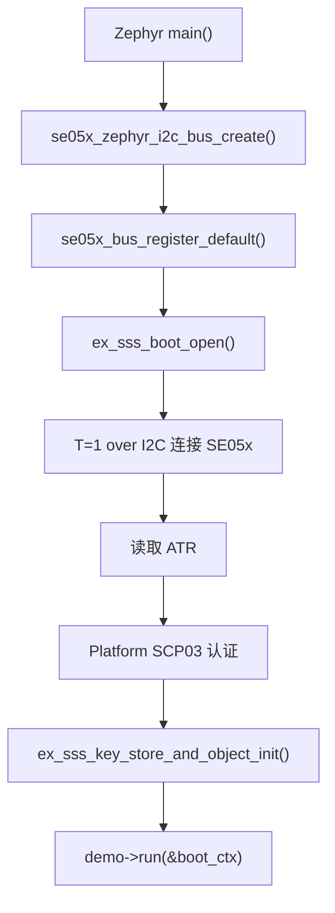
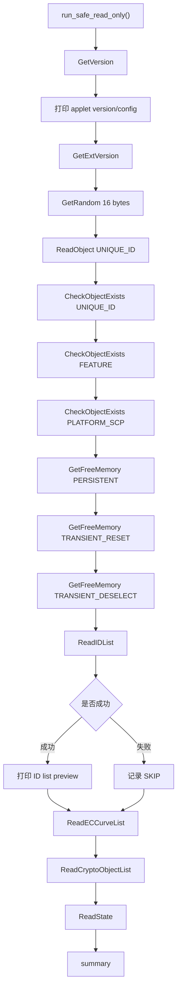
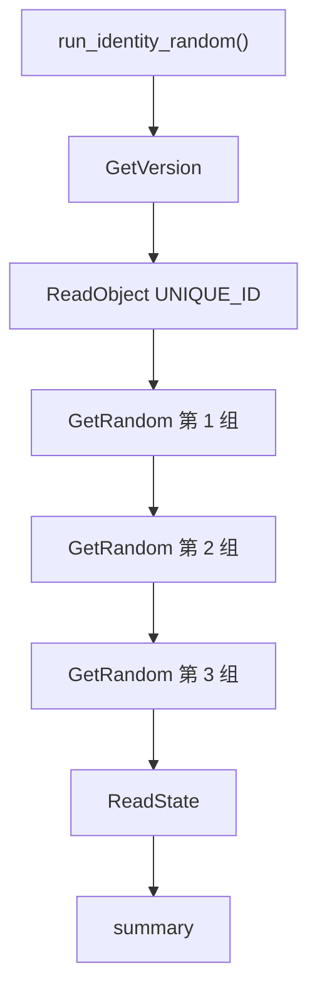
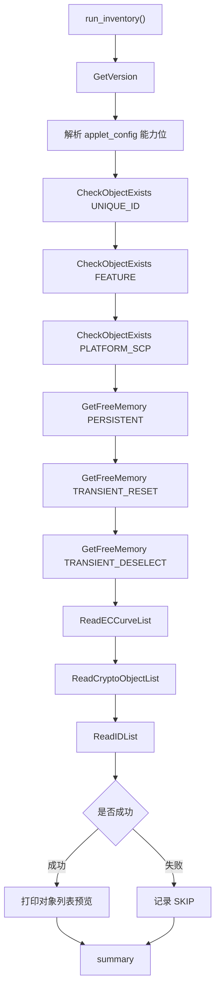
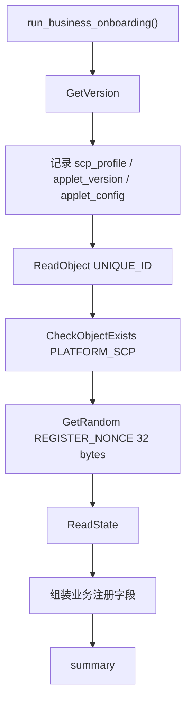
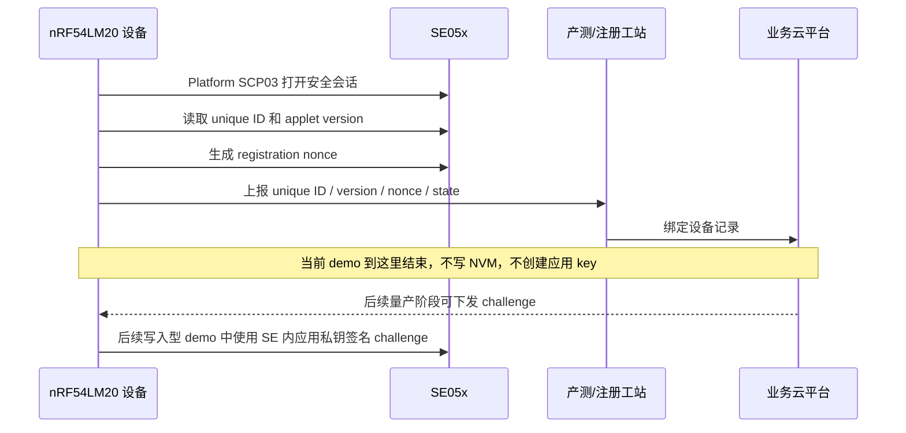
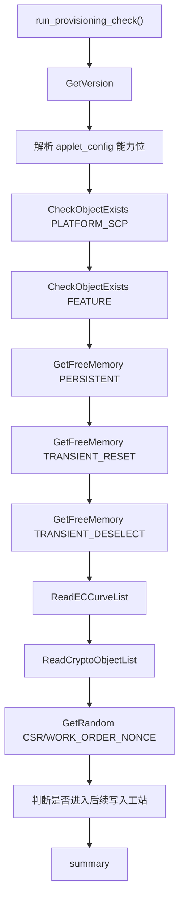
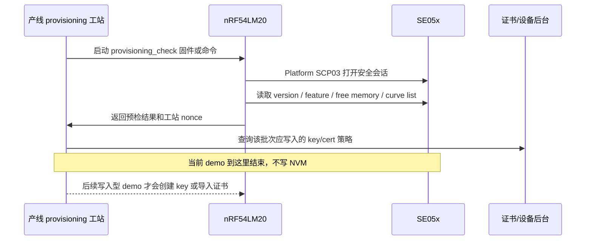

# demo 子项目说明

`demo/` 目录存放所有直接和 SE05x 交互的示例。每个 demo 都使用 `se05x_demo_编号_名称.c` 的命名方式，方便和 README、串口日志、后续 ESP32/Nordic 对照保持一致。

当前 demo 的共同原则：

- 默认不写 SE05x persistent NVM。
- 默认不创建、更新或删除 SE05x 对象。
- 先验证安全会话，再调用 APDU/SSS API。
- 每个 demo 都输出 pass、skip、fail 统计，便于现场判断。

## Demo 总览

| 编号 | 文件 | 名称 | 场景 | 是否写 NVM |
| --- | --- | --- | --- | --- |
| 01 | `se05x_demo_01_safe_read_only.c` | `safe_read_only` | 首次 bring-up、完整只读冒烟测试。 | 否 |
| 02 | `se05x_demo_02_identity_random.c` | `identity_random` | 快速读取 SE 身份和随机数。 | 否 |
| 03 | `se05x_demo_03_inventory.c` | `inventory` | 查看能力、对象、曲线、crypto object 和空间。 | 否 |
| 04 | `se05x_demo_04_business_onboarding.c` | `business_onboarding` | 真实设备注册、产测上报、云端绑定前置流程。 | 否 |
| 05 | `se05x_demo_05_provisioning_check.c` | `provisioning_check` | 应用私钥、证书、TLS 身份写入前的业务预检。 | 否 |

## 代码对应关系

| 文档章节 | 源码文件 | 入口函数 | 注册结构体 | 主要 API 类型 |
| --- | --- | --- | --- | --- |
| Demo 01 | `se05x_demo_01_safe_read_only.c` | `run_safe_read_only()` | `g_se05x_demo_safe_read_only` | 版本、随机数、对象读取、对象检查、空间、列表、状态。 |
| Demo 02 | `se05x_demo_02_identity_random.c` | `run_identity_random()` | `g_se05x_demo_identity_random` | 版本、唯一 ID、随机数、状态。 |
| Demo 03 | `se05x_demo_03_inventory.c` | `run_inventory()` | `g_se05x_demo_inventory` | 版本能力、对象检查、空间、曲线、crypto object、对象列表。 |
| Demo 04 | `se05x_demo_04_business_onboarding.c` | `run_business_onboarding()` | `g_se05x_demo_business_onboarding` | 注册身份字段、Platform SCP 对象、注册 nonce、状态。 |
| Demo 05 | `se05x_demo_05_provisioning_check.c` | `run_provisioning_check()` | `g_se05x_demo_provisioning_check` | 写入前能力、保留对象、空间、曲线、crypto object、工站 nonce。 |

所有 demo 都通过 `demo/se05x_demo.c` 中的 demo catalog 注册，再由 `src/main.c` 根据 `APP_SELECTED_DEMO` 查找并调用 `demo->run(&s_boot_ctx)`。所以 README 中的流程图、demo 编号、源码文件和串口日志名称是一一对应的。

## 通用调用前置条件

所有 demo 运行前，`src/main.c` 已经完成：



这个顺序的意义：

| 阶段 | 作用 |
| --- | --- |
| I2C bus create | 确认 Zephyr 能找到 SE05x 节点和 I2C controller。 |
| register default bus | 让 NXP hostlib 通过统一 bus contract 访问 Zephyr I2C。 |
| `ex_sss_boot_open()` | 建立 SE05x session，并完成 Platform SCP03。 |
| key store init | 为后续 key object、签名、加密类 demo 准备上下文。 |
| demo run | 只在安全会话成功后运行具体 APDU/SSS 调用。 |

## Demo 01：safe_read_only

文件：`se05x_demo_01_safe_read_only.c`

### 适用场景

这是最完整的只读冒烟测试。建议第一次接好 SE05x、换线、换板、换 overlay、改 SCP03 profile 或移植 hostlib 后优先运行它。

它回答的问题是：

- I2C 是否通。
- ATR 是否能读到。
- Platform SCP03 是否能打开。
- applet 版本是否能读到。
- SE05x random、unique ID、object check、memory、curve list、state 等只读能力是否能用。

### 使用到的 SE05x 功能和 API

| 功能 | API | 作用 |
| --- | --- | --- |
| applet 版本 | `Se05x_API_GetVersion()` | 确认 applet 存在，读取版本和能力 bitmap。 |
| 扩展版本 | `Se05x_API_GetExtVersion()` | 读取更完整的 version/config 数据。 |
| 随机数 | `Se05x_API_GetRandom()` | 验证 SE05x 内部随机数能力。 |
| 唯一 ID | `Se05x_API_ReadObject(kSE05x_AppletResID_UNIQUE_ID)` | 读取芯片唯一身份。 |
| 对象存在检查 | `Se05x_API_CheckObjectExists()` | 检查 unique ID、feature、platform SCP 等保留对象。 |
| 空间读取 | `Se05x_API_GetFreeMemory()` | 读取 persistent 和 transient 空间。 |
| 对象列表 | `Se05x_API_ReadIDList()` | 尝试枚举对象 ID，失败时当前按 skip 处理。 |
| ECC 曲线 | `Se05x_API_ReadECCurveList()` | 查看 ECC curve 列表。 |
| crypto object | `Se05x_API_ReadCryptoObjectList()` | 查看临时 crypto object 状态。 |
| SE 状态 | `Se05x_API_ReadState()` | 读取 SE 状态摘要。 |

### API 流程



### 时序作用

Demo 01 从最基础的版本读取开始，再逐步进入对象、空间、列表和状态读取。这样如果失败，日志位置可以直接说明问题层级：

- `GetVersion` 失败：优先看 I2C、T=1 over I2C、SCP03 session。
- `GetRandom` 失败：优先看 SE05x random APDU 或 session 状态。
- `ReadObject(UNIQUE_ID)` 失败：优先看对象读取权限或 object ID。
- 只有 `ReadIDList` skip：基础链路已成立，当前不作为 bring-up 失败。

### 期望输出

```text
SAFE_TEST begin: read-only, no NVM writes, no object creation
Applet version: 7.2.22
SAFE_TEST PASS GetVersion
SAFE_TEST PASS GetExtVersion
SAFE_TEST PASS GetRandom
SAFE_TEST PASS ReadObject(UNIQUE_ID)
SAFE_TEST summary: pass=13 skip=1 fail=0
SAFE_TEST overall OK
```

## Demo 02：identity_random

文件：`se05x_demo_02_identity_random.c`

### 适用场景

这是快速检查 demo，适合日常调试。它不做完整 inventory，只确认当前 SE05x 的身份和随机数接口是否稳定。

适合：

- 烧录后快速确认 SE 在线。
- 产测时读取 unique ID。
- 确认连续多次 random 调用不是固定输出。
- 为后续设备注册、云端绑定、证书流程提供身份读取基础。

### 使用到的 SE05x 功能和 API

| 功能 | API | 代码位置 | 作用 |
| --- | --- | --- | --- |
| applet 版本 | `Se05x_API_GetVersion()` | `demo_get_version()` | 先确认 APDU 通路和 applet 响应正常，同时打印版本。 |
| 唯一 ID | `Se05x_API_ReadObject(kSE05x_AppletResID_UNIQUE_ID)` | `demo_read_unique_id()` | 读取 SE05x 芯片唯一身份，可用于设备绑定、产测记录或云端注册。 |
| 随机数 | `Se05x_API_GetRandom()` | `demo_get_random()` | 连续读取 3 组 16 字节随机数，确认 SE 随机数服务可重复调用。 |
| SE 状态 | `Se05x_API_ReadState()` | `demo_read_state()` | 读取状态摘要，作为快速检查最后的状态闭环。 |

### API 流程



### 时序作用

先读版本是为了确认 APDU 通道正常；随后读 unique ID 确认设备身份；再连续读三组随机数，确认 random 服务可重复调用；最后读 state 给日志一个状态闭环。

这个顺序和代码中的 `run_identity_random()` 保持一致。它比 Demo 01 更短，适合日常快速检查；如果 Demo 02 通过但 Demo 01 后半段失败，通常说明基础 session 没问题，问题更可能在对象列表、空间查询或某个高级只读 API。

### 期望输出

```text
IDENTITY_RANDOM begin
Applet version: 7.2.22
UniqueID len=18 preview=...
Random[0] len=16 preview=...
Random[1] len=16 preview=...
Random[2] len=16 preview=...
IDENTITY_RANDOM summary: pass=... skip=0 fail=0
Demo identity_random 总体结果：OK
```

## Demo 03：inventory

文件：`se05x_demo_03_inventory.c`

### 适用场景

这是能力和资源盘点 demo，适合在准备增加写入型示例之前运行。

它重点确认：

- 当前 applet 开启了哪些能力。
- 保留对象是否存在。
- persistent/transient 空间剩余多少。
- ECC curve 和 crypto object 状态如何。

### 使用到的 SE05x 功能和 API

| 功能 | API | 代码位置 | 作用 |
| --- | --- | --- | --- |
| applet 版本和能力 | `Se05x_API_GetVersion()` | `inventory_get_version()` | 读取 applet version/config，并解析 ECDSA、HMAC、RSA、AES、TLS 等能力位。 |
| 对象存在检查 | `Se05x_API_CheckObjectExists()` | `inventory_check_object()` | 检查 `UNIQUE_ID`、`FEATURE`、`PLATFORM_SCP` 等保留对象是否存在。 |
| persistent 空间 | `Se05x_API_GetFreeMemory(kSE05x_MemoryType_PERSISTENT)` | `inventory_free_memory()` | 判断后续是否有空间创建长期保存的 key、证书或数据对象。 |
| transient reset 空间 | `Se05x_API_GetFreeMemory(kSE05x_MemoryType_TRANSIENT_RESET)` | `inventory_free_memory()` | 查看 reset 后释放的临时空间。 |
| transient deselect 空间 | `Se05x_API_GetFreeMemory(kSE05x_MemoryType_TRANSIENT_DESELECT)` | `inventory_free_memory()` | 查看 deselect 后释放的临时空间。 |
| ECC 曲线列表 | `Se05x_API_ReadECCurveList()` | `inventory_curve_list()` | 查看当前 applet 中 ECC curve 的启用状态。 |
| crypto object 列表 | `Se05x_API_ReadCryptoObjectList()` | `inventory_crypto_object_list()` | 查看临时 crypto object 列表，正常为空也可以是有效状态。 |
| 对象 ID 列表 | `Se05x_API_ReadIDList()` | `inventory_id_list()` | 尝试枚举对象 ID；当前放在最后，失败时可按 skip 处理。 |

### API 流程



### 时序作用

Demo 03 先看 applet 能力，再看保留对象，再看空间，最后看列表。`ReadIDList` 放在最后，是因为它在某些 SE 配置下可能不开放，不能让它影响前面更关键的能力判断。

这个顺序和代码中的 `run_inventory()` 保持一致。它适合在增加写入型 demo 前运行，因为写 key、导证书、做 TLS 身份前，必须先知道当前 SE 是否具备对应算法能力、保留对象是否正常、persistent 空间是否足够。

### 期望输出

```text
INVENTORY begin
Applet version: 7.2.22
ECDSA_ECDH_ECDHE  : yes
HMAC              : yes
RSA_PLAIN         : yes
AES               : yes
TLS               : yes
GetFreeMemory(PERSISTENT) free=...
ReadECCurveList len=...
ReadCryptoObjectList len=...
INVENTORY summary: pass=... skip=... fail=0
Demo inventory 总体结果：OK
```

## Demo 04：business_onboarding

文件：`se05x_demo_04_business_onboarding.c`

### 真实业务场景

这是设备注册、产测上报、云端绑定前的真实业务流程 demo。它不是单纯测试某个 API，而是模拟产品里常见的第一阶段注册材料采集：

- 设备第一次上电后，读取 SE05x 唯一 ID。
- 读取 applet version/config，确认当前安全芯片型号和能力。
- 确认 Platform SCP 对象存在，说明当前 secure channel 的基础对象可见。
- 从 SE05x 生成注册 nonce，真实业务里可用于防重放、注册请求关联或产测记录。
- 读取 SE state，作为诊断字段。

当前仍使用官方/default Platform SCP03 key/profile，不改安全配置，不写 SE05x NVM。真实量产时，后续还应该增加“SE 内应用私钥签名云端 challenge”的步骤，用来证明应用私钥确实在 SE 内且不可导出。

### 使用到的 SE05x 功能和 API

| 功能 | API | 代码位置 | 真实业务作用 |
| --- | --- | --- | --- |
| applet 版本和能力 | `Se05x_API_GetVersion()` | `onboarding_get_version()` | 注册记录里保存 SE applet 版本、能力位、SCP03 profile，方便云端和产线追踪。 |
| 设备唯一身份 | `Se05x_API_ReadObject(kSE05x_AppletResID_UNIQUE_ID)` | `onboarding_read_unique_id()` | 作为设备注册主身份之一，可和 MCU SN、PCB SN、证书序列号做绑定。 |
| Platform SCP 对象检查 | `Se05x_API_CheckObjectExists(kSE05x_AppletResID_PLATFORM_SCP)` | `onboarding_check_platform_scp()` | 确认当前用于安全通道的保留对象存在，避免把未正确配置的 SE 放入业务链路。 |
| 注册 nonce | `Se05x_API_GetRandom()` | `onboarding_get_registration_nonce()` | 生成 32 字节注册随机数，真实业务里可用于防重放、注册事务 ID 或 challenge。 |
| SE 状态 | `Se05x_API_ReadState()` | `onboarding_read_state()` | 记录 SE 状态摘要，便于产测和售后诊断。 |

### API 流程



### 真实产品中的位置



### 期望输出

```text
BUSINESS_ONBOARDING 开始
Business field: se_profile=SE052_B501
Business field: applet_version=7.2.22
Business field: device_unique_id
UniqueID len=18 preview=...
Business field: platform_scp_object=present
Business field: registration_nonce
RegisterNonce len=32 preview=...
Business field: se_state
BUSINESS_ONBOARDING summary: pass=... skip=... fail=0
Demo business_onboarding 总体结果：OK
```

## Demo 05：provisioning_check

文件：`se05x_demo_05_provisioning_check.c`

### 真实业务场景

这是应用私钥、证书、TLS 身份或业务密钥写入 SE05x 之前的真实业务预检流程。真实产线在写入之前，不应该直接创建对象，而是先确认：

- 当前 SE applet 支持目标算法能力。
- Platform SCP03 通道和保留对象正常。
- persistent 空间足够保存应用 key、证书或数据对象。
- transient 空间和 crypto object 状态正常。
- ECC curve 列表可读，后续可以选择合适曲线。
- 工站有随机 nonce 可把本次写入动作和产测记录绑定。

当前 demo 仍不写 SE05x NVM，不创建 key，不导证书。它只做真实 provisioning 工站的“写入前检查”阶段。

### 使用到的 SE05x 功能和 API

| 功能 | API | 代码位置 | 真实业务作用 |
| --- | --- | --- | --- |
| applet 版本和能力 | `Se05x_API_GetVersion()` | `provisioning_get_version()` | 判断是否支持 ECDSA、HMAC、RSA、AES、TLS 等后续业务能力。 |
| Platform SCP 对象 | `Se05x_API_CheckObjectExists(kSE05x_AppletResID_PLATFORM_SCP)` | `provisioning_check_object()` | 确认安全通道基础对象存在。 |
| feature 对象 | `Se05x_API_CheckObjectExists(kSE05x_AppletResID_FEATURE)` | `provisioning_check_object()` | 确认 feature 保留对象存在。 |
| persistent 空间 | `Se05x_API_GetFreeMemory(kSE05x_MemoryType_PERSISTENT)` | `provisioning_free_memory()` | 判断是否有空间保存长期 key、证书或业务对象。 |
| transient reset 空间 | `Se05x_API_GetFreeMemory(kSE05x_MemoryType_TRANSIENT_RESET)` | `provisioning_free_memory()` | 判断临时运算上下文空间是否正常。 |
| transient deselect 空间 | `Se05x_API_GetFreeMemory(kSE05x_MemoryType_TRANSIENT_DESELECT)` | `provisioning_free_memory()` | 判断 deselect 生命周期的临时空间是否正常。 |
| ECC 曲线列表 | `Se05x_API_ReadECCurveList()` | `provisioning_curve_list()` | 为后续 ECC key、CSR、ECDSA 签名选择曲线做准备。 |
| crypto object 列表 | `Se05x_API_ReadCryptoObjectList()` | `provisioning_crypto_object_list()` | 确认当前临时 crypto object 状态，避免工站流程残留状态影响写入。 |
| 工站 nonce | `Se05x_API_GetRandom()` | `provisioning_generate_csr_nonce()` | 生成本次 provisioning/CSR 事务 nonce，后续可写入产测记录。 |

### API 流程



### 真实产品中的位置



### 期望输出

```text
PROVISIONING_CHECK 开始
Provisioning field: scp_profile=SE052_B501
Provisioning field: applet_version=7.2.22
ECDSA_ECDH_ECDHE  : yes
AES               : yes
TLS               : yes
CheckObjectExists(PLATFORM_SCP) exists=yes
GetFreeMemory(PERSISTENT) free=...
CurveList len=...
CryptoObjectList len=...
ProvisioningNonce len=16 preview=...
PROVISIONING_CHECK summary: pass=... skip=... fail=0
Demo provisioning_check 总体结果：OK
```

## 写入型业务 demo 规划

Demo 04/05 已经覆盖真实业务的前置流程，但还没有真正写入应用 key 或证书。后续如果要覆盖完整产品用法，建议继续按 06/07/08 增加写入型 demo。

| 编号 | 建议名称 | 是否必须写 persistent NVM | 真实业务场景 | 建议实现策略 |
| --- | --- | --- | --- | --- |
| 06 | `ecc_sign_verify` | 不一定 | 设备挑战签名、云端验签、证明私钥在 SE 内。 | 先做 transient key 版本，不写 NVM；确认 API 和签名流程后，再增加 persistent key 版本。 |
| 07 | `certificate_store` | 通常会写 | 保存设备证书、证书链或业务公钥材料。 | 先只读检查空间和 object ID；真正导入证书时必须固定 object ID，并说明覆盖/删除策略。 |
| 08 | `tls_client_identity` | 通常会写 | TLS/云连接中使用 SE 内私钥和证书作为客户端身份。 | 依赖 06 的私钥和 07 的证书；先做流程文档和对象检查，再做真实 TLS 集成。 |

### 06 是否一定写 NVM

不一定。ECC 签名验签可以分两版：

- **06A transient ECC demo**：创建临时 key 或使用临时 crypto context，复位/关闭 session 后不保留，适合安全验证 API 流程。
- **06B persistent ECC demo**：把应用私钥长期保存在 SE05x persistent NVM 中，真实产品会用这个方式保存设备私钥。

建议先做 06A，因为它不会污染 SE05x，不会占用长期 object ID，也不会因为策略写错导致对象难以恢复。

### 07 和 08 为什么通常会写 NVM

证书和 TLS 身份一般需要跨重启长期存在：

- 设备证书需要长期保存，所以通常写 persistent object。
- TLS client identity 通常由“SE 内私钥 + 设备证书/证书链”组成，也需要 persistent object。
- 如果每次启动都重新导入，就不是真正的量产业务流程，而且会暴露密钥管理问题。

### 写 NVM 后是不是只要有密钥就 OK

不完全是。这里要分清几类密钥和记录：

| 密钥/记录 | 作用 | 丢失后影响 |
| --- | --- | --- |
| Platform SCP03 key | 用来打开管理/平台安全通道。当前工程先使用官方/default 配置。 | 如果生产后换成自有 SCP03 key 且丢失，可能无法再管理、更新、删除或重新 provision 对象。 |
| SE 内应用私钥 | 用于设备签名、TLS client auth、业务认证。通常不可导出。 | 如果对象被删或 SE 损坏，设备身份无法恢复，只能重新注册或报废该身份。 |
| 对象访问策略 | 决定对象能否读、写、删除、使用、认证后使用。 | 策略写错可能导致对象不能更新、不能删除或不能按预期使用。 |
| object ID 映射表 | 记录每个业务对象写在哪个 ID。 | 丢失映射会导致后续升级、删除、证书轮换非常危险。 |
| 云端绑定记录 | 记录 unique ID、公钥、证书序列号和业务账号关系。 | SE 里对象还在，但云端可能不认这台设备。 |

所以不是“有密钥就一定 OK”。真实量产至少要保存：

1. SCP03 key 或能重新建立管理会话的凭据。
2. 每个 object ID 的用途、策略、生命周期和版本。
3. 设备 unique ID、证书序列号、公钥摘要、云端绑定记录。
4. 工站写入日志和失败恢复策略。

### 密钥丢了是不是 SE 就废了

看丢的是哪一个：

- **丢了 Platform SCP03 管理 key**：SE 不一定物理报废，但后续可能无法重新 provision、删除对象、轮换证书或恢复出厂。对生产来说，这颗设备可能等同不可维护。
- **丢了云端登记记录**：SE 里对象还在，但云端不认它，业务身份可能需要重新注册。
- **丢了应用私钥备份**：正常情况下应用私钥本来就不应该有明文备份；如果私钥只存在 SE 内，这是安全设计。真正要备份的是公钥、证书、object ID 和注册关系。
- **写错对象策略且没有删除权限**：这最危险，可能导致对象占住 NVM，后续无法覆盖，只能换 object ID，严重时影响量产一致性。

### 写入型 demo 的安全规则

写入型 demo 合入前必须满足：

1. 默认不覆盖已有生产 object ID。
2. object ID 使用 `DEMO_` 或测试范围，并在 README 中明确列出。
3. 首次写入前先 `CheckObjectExists()`。
4. 如果对象已存在，默认退出，不自动覆盖。
5. 单独提供清理 demo 或清理开关，不能默认删除。
6. 串口日志必须打印 object ID、策略、是否 persistent、是否可删除。
7. README 必须写清“这个 demo 会写 NVM”。
8. 生产 key 和测试 key 必须分开，不能把生产 key 写死进仓库。

## 新增 demo 规范

新增 demo 时建议遵循：

1. 文件名使用 `se05x_demo_04_xxx.c`。
2. 在 `se05x_demo.h` 中添加枚举。
3. 在 `se05x_demo.c` 的 catalog 中注册。
4. 在根 `CMakeLists.txt` 中加入源文件。
5. 在本 README 中补充场景、时序作用、API 流程和预期输出。

如果 demo 会写 SE05x NVM，必须在文件头和 README 中明确说明：

- 会创建哪些 object ID。
- 是否覆盖已有对象。
- 是否写 persistent NVM。
- 如何清理。
- 失败后如何恢复。
