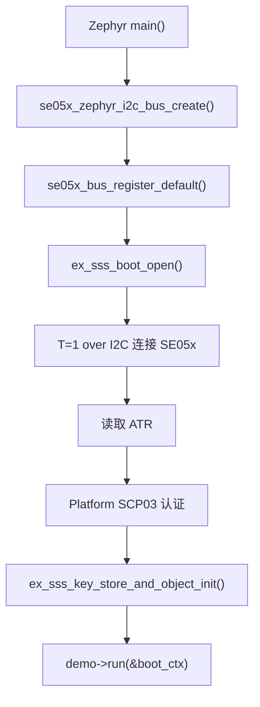
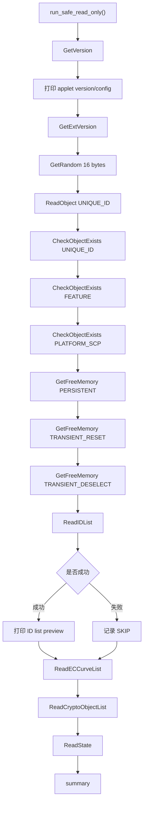
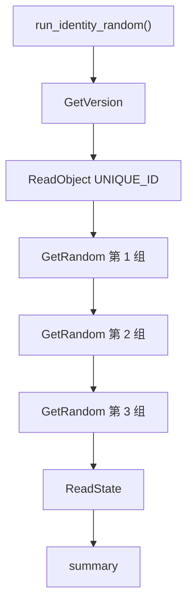
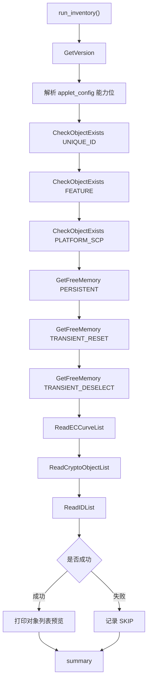

# demo 子项目说明

`demo/` 目录存放所有直接和 SE05x 交互的示例。每个 demo 都使用 `se05x_demo_编号_名称.c` 的命名方式，方便和 README、串口日志、后续 ESP32/Nordic 对照保持一致。

当前 demo 的共同原则：

- 默认不写 SE05x persistent NVM。
- 默认不创建、更新或删除 SE05x 对象。
- 先验证安全会话，再调用 APDU/SSS API。
- 每个 demo 都输出 pass、skip、fail 统计，便于现场判断。

## Demo 总览

| 编号 | 文件 | 名称 | 场景 | 是否写 NVM |
| --- | --- | --- | --- | --- |
| 01 | `se05x_demo_01_safe_read_only.c` | `safe_read_only` | 首次 bring-up、完整只读冒烟测试。 | 否 |
| 02 | `se05x_demo_02_identity_random.c` | `identity_random` | 快速读取 SE 身份和随机数。 | 否 |
| 03 | `se05x_demo_03_inventory.c` | `inventory` | 查看能力、对象、曲线、crypto object 和空间。 | 否 |

## 代码对应关系

| 文档章节 | 源码文件 | 入口函数 | 注册结构体 | 主要 API 类型 |
| --- | --- | --- | --- | --- |
| Demo 01 | `se05x_demo_01_safe_read_only.c` | `run_safe_read_only()` | `g_se05x_demo_safe_read_only` | 版本、随机数、对象读取、对象检查、空间、列表、状态。 |
| Demo 02 | `se05x_demo_02_identity_random.c` | `run_identity_random()` | `g_se05x_demo_identity_random` | 版本、唯一 ID、随机数、状态。 |
| Demo 03 | `se05x_demo_03_inventory.c` | `run_inventory()` | `g_se05x_demo_inventory` | 版本能力、对象检查、空间、曲线、crypto object、对象列表。 |

所有 demo 都通过 `demo/se05x_demo.c` 中的 demo catalog 注册，再由 `src/main.c` 根据 `APP_SELECTED_DEMO` 查找并调用 `demo->run(&s_boot_ctx)`。所以 README 中的流程图、demo 编号、源码文件和串口日志名称是一一对应的。

## 通用调用前置条件

所有 demo 运行前，`src/main.c` 已经完成：



这个顺序的意义：

| 阶段 | 作用 |
| --- | --- |
| I2C bus create | 确认 Zephyr 能找到 SE05x 节点和 I2C controller。 |
| register default bus | 让 NXP hostlib 通过统一 bus contract 访问 Zephyr I2C。 |
| `ex_sss_boot_open()` | 建立 SE05x session，并完成 Platform SCP03。 |
| key store init | 为后续 key object、签名、加密类 demo 准备上下文。 |
| demo run | 只在安全会话成功后运行具体 APDU/SSS 调用。 |

## Demo 01：safe_read_only

文件：`se05x_demo_01_safe_read_only.c`

### 适用场景

这是最完整的只读冒烟测试。建议第一次接好 SE05x、换线、换板、换 overlay、改 SCP03 profile 或移植 hostlib 后优先运行它。

它回答的问题是：

- I2C 是否通。
- ATR 是否能读到。
- Platform SCP03 是否能打开。
- applet 版本是否能读到。
- SE05x random、unique ID、object check、memory、curve list、state 等只读能力是否能用。

### 使用到的 SE05x 功能和 API

| 功能 | API | 作用 |
| --- | --- | --- |
| applet 版本 | `Se05x_API_GetVersion()` | 确认 applet 存在，读取版本和能力 bitmap。 |
| 扩展版本 | `Se05x_API_GetExtVersion()` | 读取更完整的 version/config 数据。 |
| 随机数 | `Se05x_API_GetRandom()` | 验证 SE05x 内部随机数能力。 |
| 唯一 ID | `Se05x_API_ReadObject(kSE05x_AppletResID_UNIQUE_ID)` | 读取芯片唯一身份。 |
| 对象存在检查 | `Se05x_API_CheckObjectExists()` | 检查 unique ID、feature、platform SCP 等保留对象。 |
| 空间读取 | `Se05x_API_GetFreeMemory()` | 读取 persistent 和 transient 空间。 |
| 对象列表 | `Se05x_API_ReadIDList()` | 尝试枚举对象 ID，失败时当前按 skip 处理。 |
| ECC 曲线 | `Se05x_API_ReadECCurveList()` | 查看 ECC curve 列表。 |
| crypto object | `Se05x_API_ReadCryptoObjectList()` | 查看临时 crypto object 状态。 |
| SE 状态 | `Se05x_API_ReadState()` | 读取 SE 状态摘要。 |

### API 流程



### 时序作用

Demo 01 从最基础的版本读取开始，再逐步进入对象、空间、列表和状态读取。这样如果失败，日志位置可以直接说明问题层级：

- `GetVersion` 失败：优先看 I2C、T=1 over I2C、SCP03 session。
- `GetRandom` 失败：优先看 SE05x random APDU 或 session 状态。
- `ReadObject(UNIQUE_ID)` 失败：优先看对象读取权限或 object ID。
- 只有 `ReadIDList` skip：基础链路已成立，当前不作为 bring-up 失败。

### 期望输出

```text
SAFE_TEST begin: read-only, no NVM writes, no object creation
Applet version: 7.2.22
SAFE_TEST PASS GetVersion
SAFE_TEST PASS GetExtVersion
SAFE_TEST PASS GetRandom
SAFE_TEST PASS ReadObject(UNIQUE_ID)
SAFE_TEST summary: pass=13 skip=1 fail=0
SAFE_TEST overall OK
```

## Demo 02：identity_random

文件：`se05x_demo_02_identity_random.c`

### 适用场景

这是快速检查 demo，适合日常调试。它不做完整 inventory，只确认当前 SE05x 的身份和随机数接口是否稳定。

适合：

- 烧录后快速确认 SE 在线。
- 产测时读取 unique ID。
- 确认连续多次 random 调用不是固定输出。
- 为后续设备注册、云端绑定、证书流程提供身份读取基础。

### 使用到的 SE05x 功能和 API

| 功能 | API | 代码位置 | 作用 |
| --- | --- | --- | --- |
| applet 版本 | `Se05x_API_GetVersion()` | `demo_get_version()` | 先确认 APDU 通路和 applet 响应正常，同时打印版本。 |
| 唯一 ID | `Se05x_API_ReadObject(kSE05x_AppletResID_UNIQUE_ID)` | `demo_read_unique_id()` | 读取 SE05x 芯片唯一身份，可用于设备绑定、产测记录或云端注册。 |
| 随机数 | `Se05x_API_GetRandom()` | `demo_get_random()` | 连续读取 3 组 16 字节随机数，确认 SE 随机数服务可重复调用。 |
| SE 状态 | `Se05x_API_ReadState()` | `demo_read_state()` | 读取状态摘要，作为快速检查最后的状态闭环。 |

### API 流程



### 时序作用

先读版本是为了确认 APDU 通道正常；随后读 unique ID 确认设备身份；再连续读三组随机数，确认 random 服务可重复调用；最后读 state 给日志一个状态闭环。

这个顺序和代码中的 `run_identity_random()` 保持一致。它比 Demo 01 更短，适合日常快速检查；如果 Demo 02 通过但 Demo 01 后半段失败，通常说明基础 session 没问题，问题更可能在对象列表、空间查询或某个高级只读 API。

### 期望输出

```text
IDENTITY_RANDOM begin
Applet version: 7.2.22
UniqueID len=18 preview=...
Random[0] len=16 preview=...
Random[1] len=16 preview=...
Random[2] len=16 preview=...
IDENTITY_RANDOM summary: pass=... skip=0 fail=0
Demo identity_random 总体结果：OK
```

## Demo 03：inventory

文件：`se05x_demo_03_inventory.c`

### 适用场景

这是能力和资源盘点 demo，适合在准备增加写入型示例之前运行。

它重点确认：

- 当前 applet 开启了哪些能力。
- 保留对象是否存在。
- persistent/transient 空间剩余多少。
- ECC curve 和 crypto object 状态如何。

### 使用到的 SE05x 功能和 API

| 功能 | API | 代码位置 | 作用 |
| --- | --- | --- | --- |
| applet 版本和能力 | `Se05x_API_GetVersion()` | `inventory_get_version()` | 读取 applet version/config，并解析 ECDSA、HMAC、RSA、AES、TLS 等能力位。 |
| 对象存在检查 | `Se05x_API_CheckObjectExists()` | `inventory_check_object()` | 检查 `UNIQUE_ID`、`FEATURE`、`PLATFORM_SCP` 等保留对象是否存在。 |
| persistent 空间 | `Se05x_API_GetFreeMemory(kSE05x_MemoryType_PERSISTENT)` | `inventory_free_memory()` | 判断后续是否有空间创建长期保存的 key、证书或数据对象。 |
| transient reset 空间 | `Se05x_API_GetFreeMemory(kSE05x_MemoryType_TRANSIENT_RESET)` | `inventory_free_memory()` | 查看 reset 后释放的临时空间。 |
| transient deselect 空间 | `Se05x_API_GetFreeMemory(kSE05x_MemoryType_TRANSIENT_DESELECT)` | `inventory_free_memory()` | 查看 deselect 后释放的临时空间。 |
| ECC 曲线列表 | `Se05x_API_ReadECCurveList()` | `inventory_curve_list()` | 查看当前 applet 中 ECC curve 的启用状态。 |
| crypto object 列表 | `Se05x_API_ReadCryptoObjectList()` | `inventory_crypto_object_list()` | 查看临时 crypto object 列表，正常为空也可以是有效状态。 |
| 对象 ID 列表 | `Se05x_API_ReadIDList()` | `inventory_id_list()` | 尝试枚举对象 ID；当前放在最后，失败时可按 skip 处理。 |

### API 流程



### 时序作用

Demo 03 先看 applet 能力，再看保留对象，再看空间，最后看列表。`ReadIDList` 放在最后，是因为它在某些 SE 配置下可能不开放，不能让它影响前面更关键的能力判断。

这个顺序和代码中的 `run_inventory()` 保持一致。它适合在增加写入型 demo 前运行，因为写 key、导证书、做 TLS 身份前，必须先知道当前 SE 是否具备对应算法能力、保留对象是否正常、persistent 空间是否足够。

### 期望输出

```text
INVENTORY begin
Applet version: 7.2.22
ECDSA_ECDH_ECDHE  : yes
HMAC              : yes
RSA_PLAIN         : yes
AES               : yes
TLS               : yes
GetFreeMemory(PERSISTENT) free=...
ReadECCurveList len=...
ReadCryptoObjectList len=...
INVENTORY summary: pass=... skip=... fail=0
Demo inventory 总体结果：OK
```

## 新增 demo 规范

新增 demo 时建议遵循：

1. 文件名使用 `se05x_demo_04_xxx.c`。
2. 在 `se05x_demo.h` 中添加枚举。
3. 在 `se05x_demo.c` 的 catalog 中注册。
4. 在根 `CMakeLists.txt` 中加入源文件。
5. 在本 README 中补充场景、时序作用、API 流程和预期输出。

如果 demo 会写 SE05x NVM，必须在文件头和 README 中明确说明：

- 会创建哪些 object ID。
- 是否覆盖已有对象。
- 是否写 persistent NVM。
- 如何清理。
- 失败后如何恢复。
