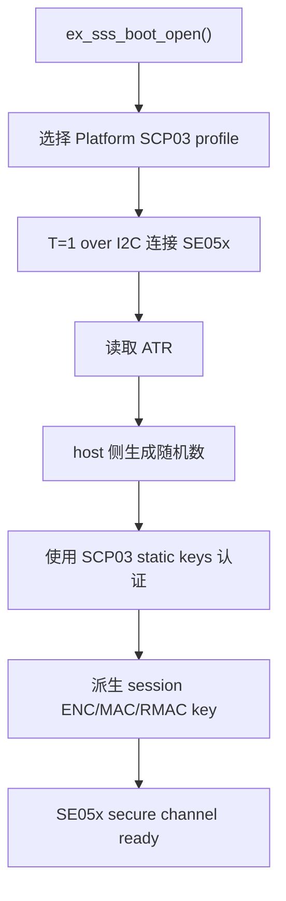

# nxp_se05x 子项目说明

`nxp_se05x/` 目录包含 NXP Plug & Trust host library、项目 feature 选择文件，以及本工程为 Zephyr/Nordic 平台补齐的 porting 层。

## 子目录职责

```text
nxp_se05x/
|-- CMakeLists.txt
|-- include/
|   |-- ex_sss_auth.h
|   `-- fsl_sss_ftr.h
|-- nxp/
|   `-- plug-and-trust/
`-- port/
    |-- i2c_a7_zephyr_bus.c
    |-- sm_timer_zephyr.c
    |-- ax_reset_zephyr.c
    |-- freertos_zephyr_shim.c
    `-- sss_user_zephyr_crypto.c
```

| 路径 | 作用 |
| --- | --- |
| `include/` | 本工程使用的 feature/profile/auth 配置入口。 |
| `nxp/plug-and-trust/` | NXP 官方 Plug & Trust hostlib 源码。 |
| `port/` | 把 NXP hostlib 需要的平台能力接到 Zephyr/Nordic。 |
| `CMakeLists.txt` | 把 hostlib 和 porting 层加入 Zephyr app 编译。 |

## 当前 SE05x profile

当前使用 Platform SCP03：

| 配置项 | 当前值 | 说明 |
| --- | --- | --- |
| `SSS_HAVE_SE05X_AUTH_PLATFSCP03` | `1` | 使用 Platform SCP03 认证方式。 |
| `SSS_PFSCP_ENABLE_SE052_B501` | `1` | 当前目标为 `SE052_B501` profile。 |
| `SSS_HAVE_HOSTCRYPTO_USER` | 按当前配置启用 | host crypto 由工程 porting 层接到 PSA/nrf_security。 |

只有在手上的 SE05x OEF、profile 或密钥来源变化时，才应该改这些配置。profile 不匹配时常见现象是能读到 ATR，但 SCP03 认证失败。

## Zephyr porting 层

| 文件 | 作用 |
| --- | --- |
| `i2c_a7_zephyr_bus.c` | 把 NXP `i2c_a7` 接口桥接到 `se05x_bus` 默认 bus。 |
| `sm_timer_zephyr.c` | 用 Zephyr sleep/timer 实现 NXP hostlib 需要的 delay。 |
| `ax_reset_zephyr.c` | 提供 reset hook，目前按当前硬件需求做轻量实现。 |
| `freertos_zephyr_shim.c` | 给 NXP 代码中少量 FreeRTOS 风格依赖提供 shim。 |
| `sss_user_zephyr_crypto.c` | 使用 PSA Crypto/nrf_security 实现 SCP03 所需 host crypto。 |

## SCP03 打开流程



## PSA Crypto 依赖

`prj.conf` 中和 SCP03 相关的关键配置包括：

```text
CONFIG_NRF_SECURITY=y
CONFIG_MBEDTLS_PSA_CRYPTO_C=y
CONFIG_PSA_WANT_KEY_TYPE_AES=y
CONFIG_PSA_WANT_ALG_CBC_NO_PADDING=y
CONFIG_PSA_WANT_ALG_ECB_NO_PADDING=y
CONFIG_PSA_WANT_ALG_CTR=y
CONFIG_PSA_WANT_ALG_CMAC=y
CONFIG_PSA_WANT_GENERATE_RANDOM=y
CONFIG_PSA_WANT_ALG_CTR_DRBG=y
```

之前如果 `CONFIG_PSA_WANT_GENERATE_RANDOM` 或 `CONFIG_PSA_WANT_ALG_CTR_DRBG` 没开，SCP03 认证阶段会失败，因为 host 侧无法生成握手随机数。

## 和 NXP 原始代码的关系

`nxp/plug-and-trust/` 保留 NXP 原始 hostlib 结构。工程移植时应尽量避免直接改 NXP 核心源码，优先在 `port/` 或 `se05x_bus/` 层适配平台差异。

这样做的原因：

- 后续升级 NXP hostlib 更容易。
- ESP32 和 Nordic 版本可以对照维护。
- 平台相关代码集中，debug 时更容易判断问题边界。

## 常见失败位置

| 现象 | 可能原因 |
| --- | --- |
| 读不到 ATR | I2C、reset、供电、地址或 T=1 over I2C 传输问题。 |
| ATR 成功但 SCP03 失败 | profile/key 不匹配，或 PSA host crypto/RNG 配置不完整。 |
| 编译缺少 crypto 符号 | `prj.conf` 中 PSA/nrf_security 能力没有打开。 |
| APDU 某项返回特殊 SW | 可能是 applet 配置、权限、对象不存在或该 API 在当前 OEF 下不可用。 |
