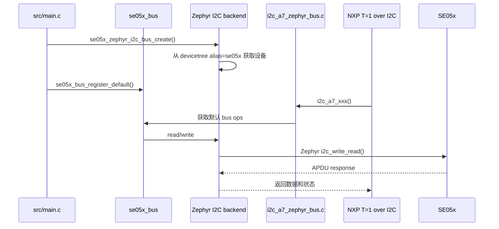

# se05x_bus 子项目说明

`se05x_bus/` 是本工程的平台无关 transport 抽象层。它的目标是让 NXP Plug & Trust hostlib 不直接依赖 ESP-IDF、Zephyr、STM32 HAL 或 Linux I2C API。

## 设计目标

SE05x hostlib 最终需要做 I2C read/write、delay、可能的 reset 和上下文保存。不同平台的 API 完全不同，所以工程中间放了一层 `se05x_bus`：

- 上层 NXP hostlib 只知道默认 bus。
- 下层平台 backend 负责真正访问 I2C。
- ESP32、Nordic、STM32、Linux 后续可以共享同一个 bus contract。

## 目录结构

```text
se05x_bus/
|-- CMakeLists.txt
|-- Kconfig
|-- include/
|   |-- se05x_bus.h
|   |-- se05x_bus_esp_idf.h
|   `-- se05x_bus_zephyr.h
`-- src/
    |-- se05x_bus.c
    |-- se05x_bus_esp_idf_i2c.c
    `-- se05x_bus_zephyr_i2c.c
```

## 核心职责

| 文件 | 职责 |
| --- | --- |
| `include/se05x_bus.h` | 定义平台无关 bus 操作接口和默认 bus 注册 API。 |
| `src/se05x_bus.c` | 保存默认 bus，并提供给 NXP porting 层调用。 |
| `include/se05x_bus_zephyr.h` | Zephyr backend 对外创建接口。 |
| `src/se05x_bus_zephyr_i2c.c` | 使用 Zephyr I2C API 实现 SE05x bus。 |
| `include/se05x_bus_esp_idf.h` | ESP-IDF backend 预留或复用接口。 |
| `src/se05x_bus_esp_idf_i2c.c` | ESP-IDF I2C backend，对照 ESP32 版本。 |

## Zephyr 调用链



## 为什么需要默认 bus

NXP Plug & Trust hostlib 的很多 C API 没有把平台 bus 指针一路传下去，而是通过 porting 层访问底层 transport。本工程用 `se05x_bus_register_default()` 在启动阶段注册一个默认 bus，让 NXP porting 层可以找到当前平台的 I2C 实现。

## 后续移植建议

新增平台时不要改 NXP hostlib 核心代码，优先新增：

```text
se05x_bus/include/se05x_bus_xxx.h
se05x_bus/src/se05x_bus_xxx_i2c.c
nxp_se05x/port/i2c_a7_xxx_bus.c
nxp_se05x/port/sm_timer_xxx.c
nxp_se05x/port/sss_user_xxx_crypto.c
```

这样能保持“一套 SE05x 逻辑，多平台 I2C backend”的结构。
