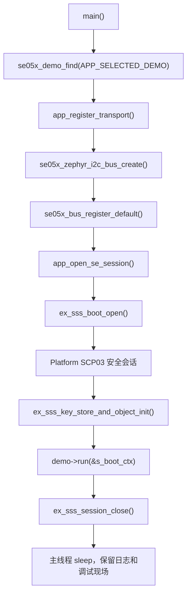

# src 子项目说明

`src/` 目录只保留应用主入口，目前核心文件是 `main.c`。具体 SE05x 示例全部放在 `demo/` 目录，不堆在主入口里。

## `main.c` 职责

`main.c` 只做五件事：

1. 选择当前要运行的 demo。
2. 初始化 nRF54LM20 到 SE05x 的 Zephyr I2C transport。
3. 将 Zephyr I2C backend 注册给 `se05x_bus` 默认 transport。
4. 通过 NXP Plug & Trust 打开 SE05x Platform SCP03 安全会话。
5. 把控制权分发给 `demo/` 目录下的具体 demo。

## 当前默认 demo

当前默认值：

```c
#define APP_SELECTED_DEMO SE05X_DEMO_ETH_TESTNET_WALLET
```

也就是 Demo11：`eth_testnet_wallet`。它用于创建或复用 SE05x 内部持久化钱包私钥对象 `0xEF110001`，输出稳定 ETH 地址，并对真实 Sepolia legacy 交易字段进行 SE 内部 secp256k1 ECDSA 签名。

## 如何切换 demo

只改 `main.c` 中这一行：

```c
#define APP_SELECTED_DEMO SE05X_DEMO_UART_SAFE_API
```

可选值：

| 宏 | 编号 | 用途 |
| --- | --- | --- |
| `SE05X_DEMO_UART_SAFE_API` | 00 | UART 交互式安全 API 菜单。 |
| `SE05X_DEMO_SAFE_READ_ONLY` | 01 | 完整只读冒烟测试。 |
| `SE05X_DEMO_IDENTITY_RANDOM` | 02 | 快速读取身份信息和随机数。 |
| `SE05X_DEMO_INVENTORY` | 03 | 查看能力、保留对象、曲线和存储空间。 |
| `SE05X_DEMO_BUSINESS_ONBOARDING` | 04 | 真实设备注册/产测上报前置流程。 |
| `SE05X_DEMO_PROVISIONING_CHECK` | 05 | 应用 key/证书写入前预检流程。 |
| `SE05X_DEMO_ECC_SIGN_VERIFY` | 06 | 写入 demo ECC 私钥并做签名验签。 |
| `SE05X_DEMO_CERTIFICATE_STORE` | 07 | 写入 demo 设备证书并回读校验。 |
| `SE05X_DEMO_TLS_CLIENT_IDENTITY` | 08 | 用 06/07 的对象模拟 TLS 客户端身份。 |
| `SE05X_DEMO_WALLET_CURVE_CHECK` | 09 | 研究 secp256k1 曲线能否启用并签名。 |
| `SE05X_DEMO_ETH_WALLET_SIGN` | 10 | ETH legacy transfer 签名链路研究，使用临时 key。 |
| `SE05X_DEMO_ETH_TESTNET_WALLET` | 11 | ETH Sepolia 测试网签名流程，使用 SE05x 持久化钱包 key。 |

## 主流程



## 调试建议

| 断点位置 | 适合排查的问题 |
| --- | --- |
| `main()` 开头 | 固件是否真正跑到应用层。 |
| `app_register_transport()` | overlay、I2C controller、SE05x alias、地址问题。 |
| `se05x_zephyr_i2c_bus_create()` | Zephyr 设备绑定、I2C ready 状态。 |
| `app_open_se_session()` | SCP03、host crypto、profile、key 配置问题。 |
| 当前 demo 的 `run_xxx()` | 具体 APDU/SSS 调用和返回状态。 |

如果 debugger 停在 Zephyr 内部 `onoff.c`、clock、UART backend 等位置，通常不是应用逻辑断住，而是 IDE 的暂停/断点/异常捕获策略导致的。可以先清理无关断点，只保留 `main.c` 和当前 demo 文件中的断点。

## 串口输出约定

固件运行时串口输出统一使用英文 ASCII，避免不同串口工具对中文 UTF-8 解码不一致导致乱码。中文解释写在 README 和源码注释里；串口菜单、状态、错误、返回值只打印英文、数字、十六进制和 `OK/FAIL/SKIP`。
