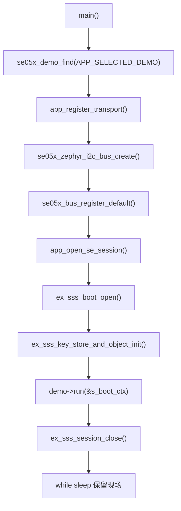

# src 子项目说明

`src/` 目录只保留应用主入口，目前只有 `main.c`。具体 SE05x 示例不堆在这里，而是放到 `demo/` 目录。

## main.c 职责

`main.c` 只做四件事：

1. 选择当前要运行的 demo。
2. 初始化 nRF54LM20 到 SE05x 的 Zephyr I2C transport。
3. 通过 NXP Plug & Trust 打开 SE05x Platform SCP03 安全会话。
4. 把控制权分发给 `demo/` 目录下的具体 demo。

## Demo 选择

修改下面这一行即可切换 demo：

```c
#define APP_SELECTED_DEMO SE05X_DEMO_SAFE_READ_ONLY
```

可选值：

| 宏 | 说明 |
| --- | --- |
| `SE05X_DEMO_SAFE_READ_ONLY` | Demo 01，完整只读冒烟测试。 |
| `SE05X_DEMO_IDENTITY_RANDOM` | Demo 02，快速读取身份和随机数。 |
| `SE05X_DEMO_INVENTORY` | Demo 03，查看能力、对象和空间清单。 |
| `SE05X_DEMO_BUSINESS_ONBOARDING` | Demo 04，设备注册/产测上报前置业务流程。 |
| `SE05X_DEMO_PROVISIONING_CHECK` | Demo 05，应用 key/证书写入前业务预检。 |
| `SE05X_DEMO_ECC_SIGN_VERIFY` | Demo 06，写入/复用 demo ECC 私钥并做签名验签。 |
| `SE05X_DEMO_CERTIFICATE_STORE` | Demo 07，写入/复用 demo 设备证书并回读校验。 |
| `SE05X_DEMO_TLS_CLIENT_IDENTITY` | Demo 08，复用 Demo 06/07 对象模拟 TLS 客户端身份。 |

## 主流程



## 调试建议

推荐断点位置：

| 位置 | 适合排查的问题 |
| --- | --- |
| `main()` 开头 | 确认固件是否真的运行到应用层。 |
| `app_register_transport()` | overlay、I2C controller、SE05x alias、地址问题。 |
| `se05x_zephyr_i2c_bus_create()` | Zephyr 设备绑定、I2C ready 状态。 |
| `app_open_se_session()` | SCP03、host crypto、profile、key 配置。 |
| 当前 demo 的 `run_xxx()` | 具体 APDU 调用和返回状态。 |

当前 `prj.conf` 已打开：

```text
CONFIG_DEBUG=y
CONFIG_DEBUG_OPTIMIZATIONS=y
```

这比 release 优化更适合源码断点。NXP hostlib 内部宏和内联较多，debugger 跳转看起来可能不够线性，这是正常现象。

## 为什么 main.c 不放具体 demo

这样拆分有几个好处：

- 主流程稳定，不会因为新增 demo 反复改启动逻辑。
- demo 可以按编号独立扩展。
- 只读 demo、写入型 demo、TLS demo、证书 demo 可以分文件管理。
- README 能和 demo 文件一一对应，后续维护更清楚。
